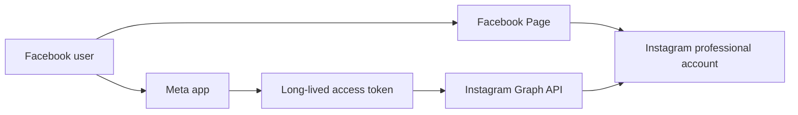
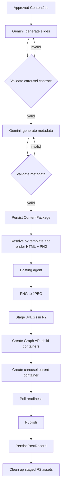

# o2 English Instagram Pipeline

## Purpose and Identity

This document defines the active o2 English implementation of the Content Factory system contracts. Read the system architecture, interfaces, and flow documents for generic responsibilities and lifecycle rules.

| Field | Value |
| --- | --- |
| `pipeline_id` | `o2_english_instagram` |
| `target_platform` | `instagram` |
| `target_account` | Configured Instagram professional account |
| `content_format` | Idiom teaching carousel |
| `visual_profile_id` | `o2_english_idiom_carousel_v1` |

The pipeline turns an approved English-learning topic into a ready-to-publish Instagram carousel. It creates content and metadata, validates both, renders slide images, and hands an immutable package to the posting agent.

## Content Contract

### Slide sequence

Each package contains 5–8 ordered slides:

1. The first slide is a `hook`.
2. It has 1–2 `explanation` slides.
3. It has 3–5 use-case slides, each either `use_case_monologue` or `use_case_dialogue`.

| Type | Purpose | Limit |
| --- | --- | --- |
| `hook` | Introduce the idiom and capture attention | 16 words |
| `explanation` | Explain meaning, nuance, and/or usage | 34 words |
| `use_case_monologue` | Show one natural first-person use | 22 words |
| `use_case_dialogue` | Show a short conversational use | At most two messages; 14 words per message |

The pipeline validates ordering, count, type-specific structure, and the word limits above before a `ContentPackage` may be persisted.

### Metadata contract

Package metadata is created only after the slides are accepted. It requires:

- A non-empty caption.
- 2–6 unique tags.
- 3–8 unique hashtags.
- Every hashtag begins with `#` and contains no whitespace.

The posting agent treats all metadata and rendered assets as immutable input. It must never write or revise captions, tags, hashtags, slide copy, or visual content.

## Generation Boundary

Gemini is used by this pipeline in two separate calls:

1. Generate the slide content using a temperature of `0.65`.
2. Once slide validation succeeds, generate caption, tags, and hashtags using a temperature of `0.45`.

If metadata generation fails validation, the pipeline retries metadata without regenerating the accepted slides. A failed slide-generation attempt does not create a package. The detector remains deterministic and LLM-free; determination uses the system-level LLM decision boundary before this pipeline begins.

Unavailable or invalid Gemini metadata fails visibly. The pipeline must not
silently replace it with hardcoded tags or hashtags.

## Templates and Visual Rendering

| Slide type | Template ID |
| --- | --- |
| `hook` | `o2_hook_centered_v1` |
| `explanation` | `o2_explanation_standard_v1` |
| `use_case_monologue` | `o2_usecase_monologue_v1` |
| `use_case_dialogue` | `o2_usecase_dialogue_v1` |

The o2 visual profile renders vertical 1080×1920 slide images using the `neutral_v1` palette and the layout appropriate to the resolved template. The visual renderer produces reviewable HTML and the PNG assets used as input to publishing. Rendering is deterministic and does not use an LLM.

The resolved template identifier and format-specific rendering specification belong to this pipeline rather than to the generic system interface.

## Instagram Delivery

The Instagram adapter delivers an already-rendered, validated package through the Instagram Graph API:

1. Convert each rendered PNG to JPEG with Pillow.
2. Upload JPEGs to the configured public Cloudflare R2 bucket and retain their public URLs only for the delivery attempt.
3. Create one Instagram carousel-item container per staged image.
4. Create a carousel parent container with the ordered child container IDs and immutable package caption.
5. Poll parent-container readiness up to five times, at five-second intervals.
6. Publish the ready parent container to the configured Instagram professional account.
7. Record child and parent container IDs with the posting attempt, then delete temporary staged R2 objects in a `finally` cleanup path.

The adapter requires 2–10 image assets. This package's 5–8 slide contract is valid for the target. Any failure before publication is returned to the posting agent as an attempt result; transient retry scheduling is a POC policy documented in `docs/poc.md`.

`post_attempts` records every delivery attempt and outcome.
`instagram_containers` records each child and parent container ID for the
request. These are Posting Agent audit records, never pipeline creative state.

### Required delivery configuration

The local `.env` file provides:

```text
INSTAGRAM_USER_ID
INSTAGRAM_ACCESS_TOKEN
INSTAGRAM_GRAPH_API_VERSION
R2_ACCOUNT_ID
R2_ACCESS_KEY_ID
R2_SECRET_ACCESS_KEY
R2_BUCKET_NAME
R2_PUBLIC_DOMAIN
```

See `docs/.env.example` for the complete configuration reference. Never commit populated secrets or access tokens.

### Meta authorization relationship



The token must authorize the app and Facebook/Instagram relationship that owns the target professional account. `INSTAGRAM_USER_ID` identifies that account for container creation and publication.

The Facebook Page is an authorization bridge, not a second publication target.
`INSTAGRAM_ACCESS_TOKEN` is a Page access token for the Page linked to the
target professional account; the local delivery adapter does not need the Meta
app ID or app secret after that token has been issued. Token renewal is future
work. The issuing app requires `instagram_basic`,
`instagram_content_publish`, `pages_show_list`, and
`pages_read_engagement` permissions for this relationship.

R2 is a transient public-media relay, not the canonical content library. Its
S3 credentials and enabled public development URL are local-only configuration.

## Pipeline Flow



## Acceptance Criteria and Boundary Tests

The implementation is acceptable when:

- Generated packages satisfy the slide contract, ordering rules, word limits, and metadata validation.
- A metadata retry retains the accepted slide set.
- Renderer output is 1080×1920 and maps every slide type to the template IDs above without changing package content.
- The adapter stages derivative JPEGs, creates ordered child containers, waits for readiness, publishes once ready, records remote IDs, and cleans up R2 assets after success or failure.
- Posting rejects malformed delivery input and never mutates the package.

Boundary tests cover generation validation, template resolution and rendering, posting-request construction, retry-safe posting behavior, Graph API delivery steps, and cleanup behavior. The root smoke-test script exercises the isolated posting path with explicit credentials; it is not part of the production workflow.

## Related Documents

- [System architecture](../architecture.md)
- [System interfaces](../interfaces.md)
- [System flow](../system-flow.md)
- [POC constraints](../poc.md)
- [Local runtime runbook](../runbooks/local-runtime.md)
