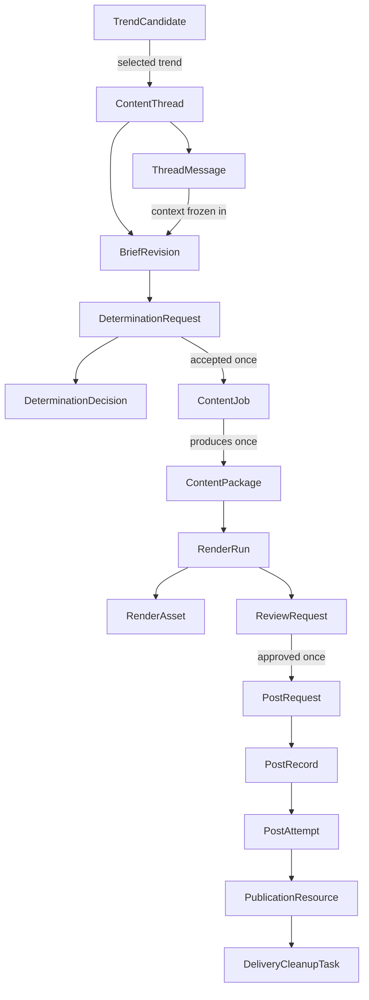

# Data Model Specification

**Status:** Approved target design; not yet implemented.
**Owner:** SQLite persistence, migrations, boundary models, and their tests.
**Read this for:** Schema, migrations, worker state, IDs, audit records, or any
change to a persisted handoff. Read [the system guide](../system.md) first.

SQLite is the authoritative state store. Every worker claims work from and
writes its result to SQLite. The dashboard reads its reporting view and writes
only the narrow human command records defined in the [dashboard specification](dashboard.md).

## Conventions and invariants

- Use `INTEGER PRIMARY KEY` IDs; enable foreign keys for every connection; do
  not reuse IDs.
- Store timestamps as UTC ISO-8601 `TEXT`.
- Use JSON `TEXT` only for structured, pipeline-specific values and name it
  `*_json`. Keep identity, status, ordering, and audit data relational.
- Messages, evidence snapshots, creative packages, decisions, attempts, and
  published records are append-only. Rework creates a new revision; it never
  overwrites history.
- Enforce status sets with SQLite `CHECK` constraints and enforce transitions
  through transactional service methods plus boundary tests.
- Acquire work with one conditional update. Do network/LLM work outside a
  transaction, then atomically write the result and terminal status.
- The production schema uses versioned forward migrations. It must refuse an
  unknown/incomplete/newer schema rather than silently apply additive changes.

## Relationship map

This is a persisted-record map, not a direct module-call diagram. The common
thread/revision lineage covers trend-originated and human-originated work.
Downstream records derive their thread/revision through foreign keys instead of
storing independently editable copies.

## Three identities

| Identity | Stored with | Meaning and uniqueness |
| --- | --- | --- |
| Evidence identity | Candidate/snapshot and determination decision | Fingerprint of normalized clustered evidence. It decides whether a rejected trend materially changed. |
| Coverage/content identity | Trend thread, accepted decision, job, and package | Canonical editorial coverage plus pipeline/destination/format/contract version and explicit changed constraints. It prevents accidental second generation. |
| Publication identity | Post request and record | One approved package/render/destination publication. It is unique and permits at most one automatic final request. |

For O2, the content identity must use the normalized teaching target,
`pipeline_id`, destination, format, and recipe/content-contract version. A
human rework is distinct only when a new frozen revision has explicit changed
constraints and `revision_reason`; workers may not add randomness merely to
bypass duplicate protection.

## Detection evidence — retained and extended

Retain `trends`, `trend_observations`, `topic_snapshots`, `trend_history`,
`source_health`, `detection_runs`, and `trend_candidates`. They remain
deterministic source evidence, never human ideas or content threads.

Extend candidate/snapshot records with:

- `evidence_fingerprint`, `score_formula_version`, and
  `canonicalization_version`;
- normalized score breakdown and cluster membership linked to exact observation
  IDs;
- stable source-adapter/source-item IDs when a provider exposes them, canonical
  URL, provider timestamp, collection time, measurement window, and normalized
  activity; and
- candidate consumption/rejection state, last evaluated fingerprint, and
  cooldown deadline.

`source_health` also records source instance, requested/actual measurement
window, item count, fallback mode, latency, and structured error category.
`detection_runs` retains Scout-run counts and errors. A selected candidate’s
exact evidence is copied into the first revision’s `source_snapshot_json`.

## Thread and revision records

### `content_threads`

| Column | Requirement |
| --- | --- |
| `thread_id` | Primary key. |
| `origin` | `trend`, `human`, or migration-only `legacy`. |
| `seed_candidate_id` | Nullable FK to `trend_candidates`; required for `trend`. |
| `coverage_identity` | Canonical editorial coverage key; unique for trend-originated threads. |
| `status` | `open`, `cancelled`, or `closed`. This is administrative, not worker state. |
| `created_at`, `updated_at`, `closed_at` | Audit timestamps. |

Enforce `origin != 'trend' OR seed_candidate_id IS NOT NULL` and
`UNIQUE(seed_candidate_id)`. A rework stays in its existing thread and creates
another revision. If a new trend maps to already consumed coverage, retain it
as evidence rather than opening a second automatic thread.

### `thread_messages`

Append-only human/agent conversation.

| Column | Requirement |
| --- | --- |
| `message_id` | Primary key. |
| `thread_id` | Required FK to `content_threads`. |
| `sequence_number` | Positive; unique within its thread. |
| `author_kind` | `human`, `intake_agent`, or `system`. |
| `body` | Non-empty original text. |
| `in_reply_to_message_id` | Optional message FK. |
| `created_at` | Timestamp. |

Messages are context, not production instructions. The Idea Intake Agent uses
them to ask a question or freeze a revision.

### `brief_revisions`

One immutable agreed brief per numbered version.

| Column | Requirement |
| --- | --- |
| `revision_id` | Primary key. |
| `thread_id`, `revision_number` | Required FK and positive number; unique pair. |
| `parent_revision_id` | Optional revision FK; must be in the same thread. |
| `input_through_message_id` | Last message considered; null for Scout-seeded Revision 1. |
| `brief_json` | Required normalized brief: target, intent, audience, constraints, and requested changes. |
| `source_snapshot_json` | Frozen candidate/detection evidence or original-conversation context. |
| `revision_reason` | `initial`, `human_rework`, or `migration`. |
| `created_by` | `intake_agent` or `system_migration`. |
| `created_at` | Freeze time. |

There is no editable draft revision. Conversation remains in messages until the
agent freezes the next immutable snapshot.

## Determination records

### `determination_requests`

This replaces trend-only `determination_handoffs`.

| Column | Requirement |
| --- | --- |
| `determination_request_id` | Primary key. |
| `revision_id` | Required unique FK: one evaluation per frozen revision. |
| `input_snapshot_json` | Exact brief, evidence, capability catalog, prompt/schema version sent to the evaluator. |
| `status` | `pending`, `claimed`, `accepted`, `rejected`, `failed`, or `cancelled`. |
| `claim_owner`, `lease_expires_at` | Safe recovery metadata. |
| `created_at`, `claimed_at`, `completed_at`, `failure_reason` | Audit/recovery fields. |

### `determination_decisions`

One decision per request: `decision_id`, unique request FK, outcome
(`accepted`/`rejected`), `recipe_json`, `reasoning`, `alternatives_json`,
evidence/coverage identities, and `created_at`. An interrupted worker with a
persisted accepted decision resumes by creating its unique missing job; it
never evaluates that revision again.

## Production and rendering records

### `content_jobs`

One job exists only for an accepted request. `determination_request_id` is a
required unique FK, replacing the current trend/candidate/handoff pointers.
It retains explicit pipeline, platform, account, format, visual profile, topic,
angle, audience, objective, key points, sources, priority, and status fields.

Status is `pending`, `claimed`, `running`, `completed`, `failed`, or
`cancelled`, with claim/lease/error/timestamps. `content_identity` is required
and unique.

### `content_packages`

One immutable package exists per job (`UNIQUE(job_id)`). It contains:

- `content_package_id`, job FK, pipeline/destination/format identifiers;
- `creative_json`, caption, `tags_json`, `hashtags_json`, `sources_json`;
- versioned `visual_spec_json`, resolved template ID/version/hash, generation
  model metadata, `content_hash`, and `created_at`.

It has no mutable “ready for posting” status. Rendering and review are separate
records. A different creative result requires a new revision/job/package.

### `render_runs` and `render_assets`

`render_runs` holds package FK, renderer ID, visual profile, frozen input,
claim/lease fields, status (`pending`, `claimed`, `running`, `succeeded`,
`failed`, `cancelled`), timestamps, safe error category/text, and an output
manifest. At most one run per package is active. Safe retries create another
run rather than overwrite assets.

`render_assets` holds run FK, unique ordinal within run, asset kind/local path,
MIME type, dimensions, bytes, SHA-256, and timestamp. A successful complete
run creates one review request. R2 delivery derivatives are not canonical
assets.

## Human review and delivery records

### `review_requests`

One review request exposes one exact package/render pair:

- package and render-run FKs, unique as a pair;
- status `awaiting_review`, `approved`, `rejected`, or `cancelled`;
- decision note, actor, decision time, and creation time.

Approval is terminal for that review request and atomically creates one post
request. Rejection is terminal and preserves the creative/history. To change
creative, start a revision.

### `post_requests`, `post_records`, and `post_attempts`

`post_requests` is the human authorization: unique review FK, package/render
FKs, destination, `delivery_mode` (`immediate`/`scheduled`), requested time,
status (`approved`, `claimed`, `cancelled`, `fulfilled`), publication identity,
and audit timestamps.

`post_records` is the external delivery lifecycle: unique request FK,
cadence-derived schedule, status (`scheduled`, `publishing`,
`retryable_failure`, `failed`, `published`, `publication_unknown`,
`cancelled`), attempts, external post ID, final timestamps, and typed error.
`publication_unknown` is terminal until human reconciliation, never automatic
retry.

`post_attempts` has a record FK, unique attempt number, start/completion,
status, typed error, and `final_publication_request_sent_at`. Create it before
the external call. Once that final request may have been transmitted, an absent
response cannot be treated as a safe retry.

### `publication_resources` and `delivery_cleanup_tasks`

`publication_resources` generalizes Instagram containers: attempt FK, optional
asset ordinal, resource type (`staged_media`, `carousel_child`,
`carousel_parent`, or later platform type), remote/object ID, status, safe
metadata, and timestamps. Never retain tokens or signed URLs.

`delivery_cleanup_tasks` owns R2 cleanup: resource FK, object key, status
(`pending`, `claimed`, `succeeded`, `failed`, `cancelled`), safe retry/lease
fields, attempts, error, and timestamps. Cleanup failure stays visible but does
not change a confirmed post to failed.

## Cross-cutting records

- `posting_policies` remains keyed by pipeline/platform/account with daily and
  interval limits.
- `model_invocations` replaces ambiguous `api_usage`: phase, applicable entity
  FKs, model, tokens/cost, outcome (`succeeded`, `transport_failed`,
  `invalid_output`, `parse_failed`, `schema_failed`), safe error, and time.
  Write it after every completed provider response before output parsing.
- `worker_runs` captures worker name, claimed entity, start/end, status, safe
  summary/error, heartbeat, and health visibility. It complements—not
  replaces—per-item state/leases.
- `schema_migrations` stores forward migration version/name/time/checksum.

## Required constraints and indexes

Use primary/foreign keys plus the named unique constraints. Required polling and
reporting indexes include:

- `trend_candidates(status, cooldown_until, evidence_fingerprint)` and cluster
  membership;
- unique trend-thread coverage identity;
- `determination_requests(status, created_at)`;
- `content_jobs(status, priority DESC, created_at)` and unique content identity;
- `render_runs(status, created_at)`;
- `review_requests(status, created_at)`;
- unique post-request publication identity;
- `post_records(status, scheduled_at, next_attempt_at)`;
- `delivery_cleanup_tasks(status, lease_expires_at)`;
- `thread_messages(thread_id, sequence_number)`;
- `brief_revisions(thread_id, revision_number)`; and
- `model_invocations(thread_id, revision_id, created_at)`.

Service methods also validate parent state: review requires complete verified
assets; post request requires approval; post attempt requires a claimable
record; a resource belongs to its creating attempt.

## Migration and cutover

The transition is forward-only and preserves persisted SQLite handoffs/history.

1. Stop workers, back up SQLite, enable foreign keys, verify a supported
   starting schema, and record the first migration version.
2. Add target tables/indexes without deleting current tables. Keep detector
   evidence unchanged.
3. Backfill each handoff into a `legacy`/`trend` thread, Revision 1, request,
   decision, job, and package lineage. Jobs without a handoff receive legacy
   lineage.
4. Backfill each rendered package into a succeeded render run/assets; create a
   pending render run for packages awaiting rendering.
5. Backfill published delivery history into request/record/attempt/resource and
   cleanup audit rows. Do not publish during migration. Place every old
   unpublished queued/scheduled/retry/failed item on migration hold and expose
   it as awaiting review; no approval is inferred.
6. Deploy target-table workers. Keep old tables read-only until record counts,
   foreign-key integrity, hashes, and dashboard traces reconcile. Archive or
   remove obsolete tables only in a separate approved migration.
7. Test constraints, concurrency, revision immutability, safe recovery,
   approval/cancellation, publication uncertainty, and migration safety.

An explicit development reset/rebuild may be added only as a documented,
destructive operator action. No worker or dashboard start path resets or
silently accepts an incompatible database.
