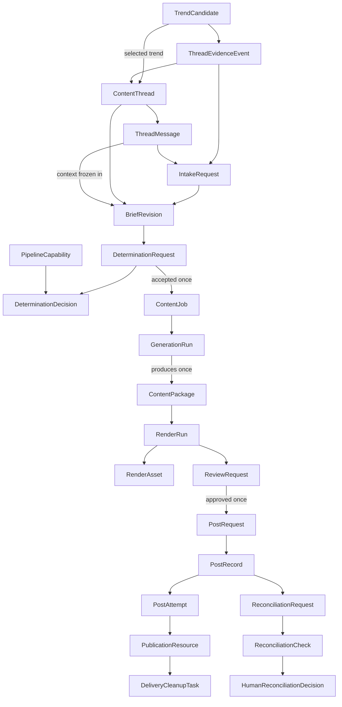

# Data Model Specification

**Document role:** Tier 2 target design contract. It defines required behavior;
verify implementation conformance from code and tests.
**Owner:** SQLite persistence, migrations, boundary models, and their tests.
**Read this for:** Schema, migrations, worker state, IDs, audit records, or any
change to a persisted handoff. Read [the system guide](../system.md) first.

SQLite is the authoritative state store. Every worker claims work from and
writes its result to SQLite. The dashboard reads its reporting view and writes
only the narrow human command records defined in the [dashboard specification](dashboard.md),
including an immediate `PostRequest` for **Post now**.

## Conventions and invariants

- Use `INTEGER PRIMARY KEY AUTOINCREMENT` for permanent audit identities;
  enable foreign keys for every connection. Audit IDs are never reused.
- Store timestamps as UTC ISO-8601 `TEXT`.
- Use JSON `TEXT` only for structured, pipeline-specific values and name it
  `*_json`. Keep identity, status, ordering, and audit data relational.
- Messages, evidence snapshots, creative packages, decisions, attempts, and
  published records are append-only. Rework creates a new revision; it never
  overwrites history.
- Enforce status sets with SQLite `CHECK` constraints and enforce transitions
  through transactional service methods plus boundary tests.
- Acquire work in one short conditional transaction. Every claim stores owner,
  claimed time, lease expiry, and a monotonic `claim_version` fencing token. Do
  network/LLM/filesystem work outside a transaction, then finalize in a second
  short transaction that still matches the claimed state, owner, and version.
- Claimable work distinguishes `retry_wait` from terminal `failed`, records
  attempt count/limit, `retry_policy_version`, `next_attempt_at`, lease
  duration, and a persisted maximum-runtime deadline. It never lets an expired
  claimant commit after another worker has reclaimed the record.
- The production schema uses versioned forward migrations. It must refuse an
  unknown/incomplete/newer schema rather than silently apply additive changes.

## Relationship map

This is a persisted-record map, not a direct module-call diagram. The common
thread/revision lineage covers trend-originated and human-originated work.
Downstream records derive their thread/revision through foreign keys instead of
storing independently editable copies.

## Four identities

| Identity | Stored with | Meaning and uniqueness |
| --- | --- | --- |
| Evidence identity | Candidate/snapshot and determination decision | Fingerprint of normalized clustered evidence. It decides whether a trend with a prior `not_recommended` outcome materially changed. |
| Coverage identity | Content thread and determination decision | Route-neutral canonical editorial target. It prevents a second automatic thread for coverage that already exists and is available before pipeline selection. |
| Content identity | Accepted decision, job, generation run, and package | Coverage plus immutable revision ID, pipeline/destination/format, and recipe/content-contract version. It prevents duplicate automatic generation while allowing explicit human rework. |
| Publication identity | Post request and record | One explicit review-approval cycle for an exact package/render/destination. It permits at most one automatic final request while allowing a later, separately approved cycle only when review/reconciliation policy authorizes one. |

For O2, coverage identity uses the normalized teaching target. Content identity
adds immutable `revision_id`, `pipeline_id`, destination, format, and
recipe/content-contract version. A worker may not create a revision or add
randomness merely to bypass duplicate protection. Revisions arise only from an
explicit human rework, approved automatic evidence refresh, or migration.

## Detection evidence — retained and extended

Retain `trends`, `trend_observations`, `topic_snapshots`, `trend_history`,
`source_health`, `detection_runs`, and `trend_candidates`. They remain
deterministic source evidence, never human ideas or content threads.

Add `detection_source_instances` as the persisted source registry. It holds a
stable source-instance ID, source-kind/version, provider display name,
endpoint/feed URL, declared delivery format where applicable, coverage note,
enabled state, expected poll cadence/availability interval, static trust weight,
independence group, language/region scope, local quota limit where applicable,
safe configuration JSON/fingerprint, and audit timestamps. `source_health` and
every observation/run link to this record. A run stores the exact enabled-source
configuration snapshot it used; credentials never enter the database.

Add append-only `detection_cluster_aliases` with its exact normalized alias key,
target cluster key, canonicalization version, active state, recorded reason,
configuration version, and audit timestamps. An alias is operator-managed
deterministic configuration, never an LLM output or inference. Retain the
observation-to-cluster membership that was used for every scored candidate so a
later alias change cannot rewrite historical evidence.

Extend candidate/snapshot records with:

- `evidence_fingerprint`, `score_formula_version`, and
  `canonicalization_version`;
- normalized score breakdown and cluster membership linked to exact observation
  IDs;
- cluster key, candidate coverage identity, canonicalization version, and the
  exact alias-configuration version used;
- stable source-adapter/source-item IDs when a provider exposes them, canonical
  URL, provider timestamp, collection time, measurement window, and normalized
  activity; and
- candidate consumption and last determination outcome, last evaluated
  fingerprint, cooldown deadline, and shortlist policy/audit data: eligibility
  reason, rank, selected/deferred time, and selected thread ID.

Candidate eligibility uses an explicit closed state set rather than inferring
meaning from nullable timestamps: `eligible`, `selected`,
`deferred_by_budget`, `rejected_cooldown`, `reconsiderable`, `consumed`, and
`migration_hold`.
`selected` means an Intake request was durably created; `consumed` means an
accepted route already owns that automatic opportunity. A `not_recommended`
decision moves the candidate to `rejected_cooldown`. Expiry alone makes it
`reconsiderable`; it does not authorize duplicate content. Re-evaluation also
requires a materially different evidence fingerprint under the versioned
Detection policy.

`thread_evidence_events` records later evidence mapped to an existing coverage
identity. It stores the candidate/thread FKs, prior and current evidence
fingerprints, comparator version, materiality outcome/reason, frozen evidence
snapshot, resulting Intake-request FK when material, and timestamps. Any later
revision is reached through that immutable Intake-request lineage rather than
backfilled onto the event. This append-only record is the audit bridge for
evidence refresh. Material evidence continues the existing thread; it never
creates a duplicate thread.

`source_health` also records source instance, requested/actual measurement
window, item count, completeness result, health classification/reason, fallback
mode, latency, and structured error category. `detection_runs` retains Scout-run
counts and errors. Shortlist audit retains eligibility, rank, `selected_at`,
deferred/stale reason, and the frozen score/evidence used for any recurrence
comparison. A selected candidate’s exact evidence is copied into the first
revision’s `source_snapshot_json`.

## Thread and revision records

### `content_threads`

| Column | Requirement |
| --- | --- |
| `thread_id` | Primary key. |
| `origin` | `trend`, `human`, or migration-only `legacy`. |
| `seed_candidate_id` | Nullable FK to `trend_candidates`; required for `trend`. |
| `coverage_identity` | Canonical editorial coverage key. Required and immutable once Revision 1 exists; unique when present. |
| `status` | `open`, `cancelled`, or `closed`. This is administrative, not worker state. |
| `created_at`, `updated_at`, `closed_at`, `cancelled_at` | Audit timestamps. |
| `closure_actor`, `closure_reason` | Required audit fields when `closed` or `cancelled`; safe human-provided reason is optional. |

Enforce `origin != 'trend' OR seed_candidate_id IS NOT NULL` and
`UNIQUE(seed_candidate_id)`. A trend thread receives its coverage identity in
the same transaction that creates it. A human thread may begin without one,
but Idea Intake must assign it atomically with Revision 1; it is immutable
thereafter. A rework stays in its existing thread and creates another revision.
If a new subject cannot truthfully retain the existing coverage identity, it
requires an explicit new human thread. If a new trend maps to already consumed
coverage, retain it as evidence rather than opening a second automatic thread.

`closed` is an orderly archival state. It may be entered only when no
claimable/claimed intake, determination, generation, render, review, or
delivery record remains for the thread; terminal failed, rejected, cancelled,
published, and `publication_unknown` history remains visible. A human must
explicitly reopen a closed thread before continuing it; reopening changes only
the administrative thread status and creates no revision by itself.

`cancelled` is an instruction to stop unfinished work. It is terminal for the
thread: it cannot be reopened, and a later materially new idea requires a new
thread. Cancellation does not delete or mutate immutable history. Its permitted
cascade and the final-publication boundary are defined in the Idea Intake and
Determination and Posting contracts.

The POC uses a strictly linear revision history: a new revision must name the
current latest revision as parent. Only one non-terminal Intake request may
exist per thread.

### `thread_messages`

Append-only human/agent conversation.

| Column | Requirement |
| --- | --- |
| `message_id` | Primary key. |
| `thread_id` | Required FK to `content_threads`. |
| `sequence_number` | Positive; unique within its thread. |
| `author_kind` | `human`, `intake_agent`, or `system`. |
| `body` | Non-empty original text. |
| `in_reply_to_message_id` | Optional message FK. |
| `created_at` | Timestamp. |

Messages are context, not production instructions. The Idea Intake Agent uses
them to ask a question or freeze a revision.

### `intake_requests`

An Intake request is the durable handoff to the Idea Intake Agent. It contains
the thread FK, optional current/parent revision FK, optional first/last
input-message FKs (null for a trend event without a human message), frozen
request context/version, and status (`pending`, `claimed`,
`retry_wait`, `needs_clarification`, `completed`, `failed`, or `cancelled`). It
also records claim owner/time/lease/version, attempt count/limit,
`next_attempt_at`, safe error, result message/revision FKs, and audit
timestamps.

`needs_clarification` is terminal for that individual request (and therefore
not claimable), while the thread remains open awaiting a later human command.

Creating a human thread, its first message, and its first Intake request is one
transaction. Continuing a thread appends the human message and creates the
next Intake request in one transaction. A clarification response creates a
new request; the prior request remains `needs_clarification`. A completed
request creates exactly one revision and its pending Determination request in
the same transaction. An evidence-refresh event uses the same handoff and
references the event that caused it.

### `brief_revisions`

One immutable agreed brief per numbered version.

| Column | Requirement |
| --- | --- |
| `revision_id` | Primary key. |
| `thread_id`, `revision_number` | Required FK and positive number; unique pair. |
| `parent_revision_id` | Optional revision FK; must be in the same thread. |
| `input_through_message_id` | Last message considered; may be null only when no human message exists. |
| `brief_json` | Required normalized brief defined by the Idea Intake and Determination contract: editorial goal, topic, audience, desired outcome, constraints/preferences, and requested changes. |
| `source_snapshot_json` | Frozen candidate/detection evidence or original-conversation context. |
| `revision_reason` | `initial`, `human_rework`, `evidence_refresh`, `capability_recheck`, or `migration`. |
| `created_by` | `intake_agent`, `system`, or `system_migration`. |
| `source_intake_request_id`, `source_evidence_event_id`, `source_blocked_decision_id` | The Intake request, optional evidence event, and optional blocked decision that caused the revision. A capability recheck names its blocked decision and has no Intake request; migration is the other exception to the Intake-request requirement. |
| `created_at` | Freeze time. |

There is no editable draft revision. Conversation remains in messages until the
agent freezes the next immutable snapshot. A `capability_recheck` is the sole
non-conversational revision: the dashboard's explicit command copies the frozen
brief/source context unchanged, names the prior blocked decision, and creates a
new Determination request with a newly frozen routing-input snapshot. It never
changes editorial content or overwrites the old decision.

## Determination records

### `determination_requests`

This replaces trend-only `determination_handoffs`.

| Column | Requirement |
| --- | --- |
| `determination_request_id` | Primary key. |
| `revision_id` | Required unique FK: one evaluation per frozen revision. |
| `input_snapshot_json` | Exact brief, evidence, capability catalog, prompt/schema version sent to the evaluator. |
| `status` | `pending`, `claimed`, `retry_wait`, `completed`, `failed`, or `cancelled`. The decision outcome is stored separately. |
| `claim_owner`, `claimed_at`, `lease_expires_at`, `claim_version` | Fenced recovery metadata. |
| `attempt_count`, `attempt_limit`, `next_attempt_at` | Bounded retry metadata. |
| `created_at`, `completed_at`, `failure_reason` | Audit/recovery fields. |

### `determination_decisions`

One decision per request: `decision_id`, unique request FK, outcome
(`accepted`, `not_recommended`, or `blocked`), selected capability when one
exists, `recipe_json` for an accepted route, `reasoning`, `alternatives_json`,
warnings, evidence/coverage identities, and `created_at`. An interrupted worker
must not leave an accepted decision without its job: accepted decision,
Content Job, and completed request are committed in one transaction. A repair
path may create a unique missing job only for legacy or interrupted rows that
predate this invariant; it never evaluates that revision again. The full decision contract is in
[Idea Intake and Determination](idea-intake-and-determination.md).

## Production and rendering records

### `content_jobs`

One job exists only for an accepted decision. `determination_request_id` is a
required unique FK, replacing the current trend/candidate/handoff pointers.
It retains explicit pipeline, platform, account, format, allowed
renderer-profile set/selection policy, topic, angle, audience, objective, key
points, sources, priority, and status fields.

Status is `pending`, `claimed`, `running`, `retry_wait`, `completed`, `failed`,
or `cancelled`, with the common fenced-claim, bounded-retry, error, and
timestamp fields. `content_identity` is required and unique.

### `generation_runs`

One or more auditable generation attempts may exist for a job, but only one is
active at a time. It holds the job FK, pipeline/contract version, frozen recipe
input, claim/lease fields, status (`pending`, `claimed`, `running`,
`retry_wait`, `succeeded`, `failed`, `cancelled`), common fenced-claim and
bounded-retry fields, timestamps, safe failure category/text, current
checkpoint (`creative` or `metadata`), and immutable validated creative
snapshot JSON/hash.

A pipeline persists the validated creative snapshot before any dependent
metadata stage. This allows bounded metadata retries after restart without
regenerating accepted creative. `model_invocations` link each generation or
metadata call to the run. A successful run creates one immutable package;
creative change after package creation requires a new revision/job/run, never
an update to the prior run.

### `content_packages`

One immutable package exists per successful generation run
(`UNIQUE(generation_run_id)`) and remains unique per job. It contains:

- `content_package_id`, job FK, required generation-run FK,
  pipeline/destination/format identifiers;
- `creative_json`, caption, `tags_json`, `hashtags_json`, `sources_json`;
- pipeline-owned typed teaching/provenance evidence within `creative_json`,
  including claim-to-reference mappings and the reference catalog/content
  hashes required by the selected pipeline contract;
- versioned `visual_spec_json`, resolved renderer-owned profile/template
  ID/version/hash for every visual unit, generation model metadata,
  `content_hash`, and `created_at`. The reusable visual-spec contract is owned
  by [Visual Rendering](visual-rendering.md).

It has no mutable “ready for posting” status. Rendering and review are separate
records. A different creative result requires a new revision/job/package.

### `render_runs` and `render_assets`

`render_runs` holds package FK, renderer-provider ID/version, resolved
renderer-owned profile/template selection, frozen input/specification hash,
resolved font/asset input versions,
common fenced-claim and bounded-retry fields, status (`pending`, `claimed`,
`running`, `retry_wait`, `succeeded`, `failed`, `cancelled`), timestamps, safe
error category/text, and an output manifest. At most one run per package is
active. Safe retries create another run rather than overwrite assets.

`render_assets` holds run FK, `asset_role`, unique ordinal within role, local
path, MIME type, dimensions, bytes, SHA-256, conversion/encoder version, and
timestamp. Roles include `preview_html`, `preview_png`, and
`delivery_jpeg`; destination-specific references may add stricter roles. The
delivery JPEG is generated and verified locally and is canonical review input.
The RenderRun frozen input records each unit's profile/template/theme IDs,
binding hash, local font/asset hashes, output dimensions, validation result,
and renderer/Chromium/encoder versions.
A successful complete run atomically freezes the output manifest and creates
one review request. R2 copies and signed delivery URLs are transport
derivatives, not canonical assets.

## Human review and delivery records

### `review_requests`

One review request exposes one exact package/render/destination review cycle:

- package and render-run FKs plus a positive review-cycle number, unique as a
  triple;
- required content-package hash and render-manifest hash copied at creation;
- status `awaiting_review`, `approved`, `changes_requested`, `rejected`,
  `invalidated`, `expired`, or `cancelled`;
- creation, expiry, decision, and terminal-state timestamps plus decision
  note and actor.

Only one review request may be active per package/render/destination. Approval first revalidates
the package, manifest, asset hashes, policy freshness, and destination/profile
compatibility; it is terminal for that request and atomically creates one post
request plus its initial post record. `changes_requested` atomically appends a
human thread message and an Intake request for a new revision. Rejection is
terminal and preserves the creative/history. Any asset/package mutation or
superseding revision invalidates the request; creative change always starts a
new revision. Only an explicit human command may create a later review cycle
for the unchanged package/render/destination triple; it is permitted only after
this request is `expired` or after a linked `not_published_cancel` reconciliation
decision. A confirmed-published package is never eligible for another cycle.

### `post_requests`, `post_records`, and `post_attempts`

`post_requests` is immutable human authorization: unique review FK,
package/render FKs and approved hashes, destination, `delivery_mode`
(`immediate` only in the initial POC), request time, status (`approved`,
`cancelled`, `expired`, `fulfilled`), expiry time, publication identity, and
audit timestamps. It is
not worker-claimable. The initial POC does not persist a human-requested
delivery time or schedule.

`post_records` is the external delivery lifecycle: unique request FK,
policy-derived `eligible_at`, status (`pending`, `claimed`, `publishing`,
`retry_wait`, `failed`, `published`, `publication_unknown`, `cancelled`,
`expired`), the
common fenced-claim/bounded-retry fields, external post ID, final timestamps,
and typed error.
`publication_unknown` is terminal until human reconciliation, never automatic
retry.

`delivery_mode=immediate` records the human's requested urgency; the active
posting policy still owns the computed `eligible_at`. The architecture does
not infer whether immediate mode bypasses cadence. If the versioned policy does
not explicitly answer that question, creation/delivery is blocked rather than
guessed.

`posting_policies` stores IANA account time zone, daily cap, minimum interval,
policy version, and slot-reservation rule. For O2 `posting_policy_v1`, these
are `Asia/Seoul`, one post/account-day, 20 hours, and reservation only after a
possible final provider request. The policy-derived `eligible_at` and expiry
are copied to the Post Record audit trail.

The 48-hour immediate-request expiry is evaluated transactionally before a
claim and before the final provider request. If no attempt has begun by that
time, the authorization and record both transition to `expired`; neither may
later be reclaimed. An exact reviewed package may have at most one
confirmed-published publication identity across all of its review cycles.

`post_attempts` has a record FK, unique attempt number, start/completion,
status, typed error, and `final_publication_request_sent_at`. Create it before
the external call. Once that final request may have been transmitted, an absent
response cannot be treated as a safe retry.

### `publication_resources` and `delivery_cleanup_tasks`

`publication_resources` generalizes Instagram containers: attempt FK, optional
asset ordinal, resource type (`staged_media`, `carousel_child`,
`carousel_parent`, or later platform type), remote/object ID, status, safe
metadata, and timestamps. Never retain tokens or signed URLs.

`delivery_cleanup_tasks` owns R2 cleanup: resource FK, object key, status
(`pending`, `claimed`, `retry_wait`, `succeeded`, `failed`, `cancelled`), the
common fenced-claim/bounded-retry fields, error, and timestamps. Cleanup
failure stays visible but does not change a confirmed post to failed.

### Reconciliation records

`reconciliation_requests` is the durable operator/agent work item for one
`publication_unknown` Post Record. It stores reason, status (`pending`,
`claimed`, `retry_wait`, `needs_human`, `resolved`, `failed`, `cancelled`), the
common fenced-claim/bounded-retry fields, and audit timestamps. At most one is
active per Post Record.

Each external inspection creates an append-only `reconciliation_check` with
request FK, provider query/matching-rule version, safe response summary/hash,
candidate external IDs, outcome (`confirmed_published`,
`confirmed_not_published`, `ambiguous`, or `provider_unavailable`), and time.
Automation may resolve only an unambiguous published match. A
`human_reconciliation_decision` records actor, exact check/evidence considered,
decision (`published`, `not_published_cancel`, or `leave_unknown`), note, and
time. No reconciliation path silently retries the final publication call.

## Cross-cutting records

- `pipeline_capabilities` is the persisted enabled capability catalog.
  It has a stable capability ID, pipeline/platform/account/format/visual-profile
  identifiers, contract version, `enabled` state, supported goals/audiences and
  input constraints JSON, deterministic priority/tie-break metadata, safe
  dependency/configuration requirements, and audit timestamps. It does not
  store credentials. A determination request freezes the exact applicable
  catalog snapshot rather than relying on a later mutable lookup.
- `posting_policies` remains keyed by pipeline/platform/account with daily and
  interval limits.
- `human_command_receipts` provides command idempotency and audit for dashboard
  writes: unique client command ID, command kind, durable actor identifier,
  short-lived local browser-session identifier where applicable, target
  record/version, safe payload hash, result-record references, and timestamp.
  The POC records `local_owner` for every dashboard command. Repeating the same
  ID/payload returns the original result; reusing it with different input is
  rejected.
- `model_invocations` replaces ambiguous `api_usage`: phase, applicable entity
  FKs including `generation_run_id`, attempt ordinal, request/prompt/schema
  version and safe request hash, model/provider request ID, response hash,
  tokens/cost, outcome (`started`, `succeeded`, `transport_failed`,
  `invalid_output`, `parse_failed`, `schema_failed`), safe error, start time,
  and completion time. Insert and commit `started` before the provider call;
  finalize that row immediately after response or transport failure and before
  interpreting output. A stale `started` row is an uncertain-cost audit event,
  not evidence that no call occurred.
- `gemini_budget_reservations` records the UTC accounting day, model invocation
  or claim FK, worst-case reserved cost, settled cost when known, status, and
  audit timestamps. A unique active reservation binds one invocation/claim;
  daily admission checks settled cost plus active reservations atomically.
- `worker_heartbeats` keeps one current health row per worker instance: worker
  type, instance ID, start/last-seen time, state, current claim reference, build
  version, and safe health summary. Heartbeats update this row rather than
  generating append-only noise.
- `worker_runs` is append-only and records only substantive invocations that
  claim or process work: worker name/instance, claimed entity, start/end,
  status, and safe summary/error. It complements—not replaces—per-item
  state/leases and the current heartbeat row.
- `storage_samples` is append-only: sampled time, free/total bytes, threshold
  state, SQLite/WAL/artifact/backup bytes, and safe diagnostic summary. The
  latest sample drives the shared claim gate; it never contains file listings.
- `maintenance_runs` is append-only: kind (`sqlite_backup`, `restore_verify`,
  `wal_checkpoint`, or `artifact_retention`), start/end/status, safe counts,
  backup identity/checksum where applicable, and safe failure detail.
- `schema_migrations` stores forward migration version/name/time/checksum.

## Required constraints and indexes

## Baseline DDL and transition rules

The target migration uses `INTEGER PRIMARY KEY` audit IDs, `TEXT NOT NULL`
UTC timestamps, `TEXT` JSON columns, `INTEGER` booleans constrained to `0/1`,
and explicit `CHECK` status sets. Required business references use `NOT NULL`
foreign keys; optional lineage references are nullable. All audit/history
foreign keys use `ON DELETE RESTRICT`; no published, review, attempt, model, or
evidence record is cascade-deleted. Mutable queue rows are updated only through
their owning transactional service; append-only records are never updated after
creation except for completion fields explicitly named by their contract.

Every claimable table shares this transition envelope: `pending|retry_wait`
→ `claimed` → `running|publishing` where applicable → `succeeded|completed|
published|failed|cancelled`, with lease expiry returning only safe work to
`retry_wait`. A transition requires the expected prior status, owner, and
`claim_version`; terminal rows cannot be reclaimed. Each table's stated status
set narrows this envelope. Partial unique indexes enforce at most one active
claim/run/review/reconciliation item per owning entity; active means a
non-terminal status, never merely a nullable completion time.

The baseline migration must be reviewed as generated SQL plus typed boundary
models and tests. It may not infer a column, FK action, status, default, or
transition from legacy code.

### Column, foreign-key, and retention catalog

This is the canonical baseline catalog. `id` means `INTEGER PRIMARY KEY`; every
`*_id` is `INTEGER NOT NULL` and references the named parent with `ON DELETE
RESTRICT` unless the row says optional. `created_at` is `TEXT NOT NULL` UTC;
`updated_at`, `completed_at`, and `deleted_at` are nullable UTC `TEXT`. A
required scalar is `TEXT NOT NULL`, `INTEGER NOT NULL`, or `REAL NOT NULL` as
its name/value requires; a `*_json` value is validated `TEXT NOT NULL`; and a
boolean is `INTEGER NOT NULL CHECK (value IN (0,1))`. `status` is `TEXT NOT
NULL` with the exact documented `CHECK` set and has no implicit default. Queue
rows use explicit creation status; immutable/audit rows have no update path.
Every retained row has `created_at`; mutable registries additionally have
`updated_at`. "Audit" means retain the row indefinitely in SQLite backups;
"artifact" means retain its manifest/hash audit row indefinitely while T11 may
delete only the referenced physical bytes under its documented conditions.

| Table | Required columns beyond common `id` / timestamps | Parent FKs and uniqueness | Owner / retention |
| --- | --- | --- | --- |
| `detection_source_instances` | stable ID, kind/version, provider, endpoint, format nullable, coverage, enabled, cadence/availability, trust, independence, scope, quota nullable, config/fingerprint | `UNIQUE(stable_id)` | Detection registry / audit |
| `detection_runs` | source-config snapshot, measurement window, status, counts, safe error, claim envelope | source instance optional for aggregate run | Trend Scout / audit |
| `source_health` | window, item count, completeness, classification/reason, fallback, latency, error category | source instance; `UNIQUE(source_instance_id, measurement_window_end)` | Detection / audit |
| `trends` | canonical subject/key, first/last observed, safe current metadata | `UNIQUE(canonical_key)` | Detection / audit |
| `trend_observations` | source item ID nullable, canonical URL nullable, provider/collection time, window, activity/rank, payload | source instance and trend; `UNIQUE(source_instance_id, source_item_id)` where source item exists | Detection / audit |
| `topic_snapshots` | normalized cluster/key, score inputs, evidence snapshot/hash, formula/canonicalization version | trend/candidate nullable; exact snapshot hash unique within its owning run | Detection / audit |
| `trend_history` | candidate/trend state event, old/new status, reason, score/rank snapshot | trend and candidate nullable | Detection / audit |
| `detection_cluster_aliases` | normalized alias, target key, canonicalization/config version, active, reason | `UNIQUE(alias_key, canonicalization_version, configuration_version)` | Detection configuration / audit |
| `trend_candidates` | cluster, coverage/evidence identities, score/rank/breakdown, eligibility/status, cooldown, shortlist and consumption audit | selected thread optional; unique evidence fingerprint within formula/canonicalization version | Detection / audit |
| `candidate_observation_memberships` | ordinal, contribution, frozen observation snapshot | candidate and observation; `UNIQUE(candidate_id, observation_id)` | Detection / audit |
| `content_threads` | origin, seed candidate nullable, coverage identity nullable, administrative status, closure audit | seed candidate optional; `UNIQUE(seed_candidate_id)`, unique non-null coverage identity | Idea Intake / audit |
| `thread_evidence_events` | old/new evidence fingerprints, comparator/outcome, snapshot, result Intake FK nullable | candidate and thread; result intake optional | Detection + Intake / audit |
| `thread_messages` | sequence, author kind, body, reply ID nullable | thread; optional self-reply; `UNIQUE(thread_id, sequence_number)` | Dashboard / audit |
| `intake_requests` | revision/message/event references nullable as documented, context/version, status, claim envelope, result references nullable, safe error | thread plus optional parent references; one active request per thread | Idea Intake / audit |
| `brief_revisions` | revision number, parent nullable, input message nullable, brief/source snapshot, reason, creator, causation references | thread plus optional same-thread parent/source references; `UNIQUE(thread_id, revision_number)` | Idea Intake / audit |
| `pipeline_capabilities` | pipeline/platform/account/format/profile IDs, contract version, enabled, goals/constraints, priority/tie-break, config requirements | `UNIQUE(pipeline_id, platform_id, account_id, format_id, contract_version)` | Capability catalog / audit |
| `determination_requests` | revision snapshot, status, claim envelope, failure fields | `UNIQUE(revision_id)` | Determination / audit |
| `determination_decisions` | outcome, capability nullable, recipe nullable, reasoning, alternatives/warnings, identities | `UNIQUE(determination_request_id)` | Determination / audit |
| `content_jobs` | pipeline/destination/format/profile policy, frozen recipe/editorial fields, priority, content identity, status, claim envelope | `UNIQUE(determination_request_id)`, `UNIQUE(content_identity)` | Pipeline Runner / audit |
| `generation_runs` | pipeline/contract, frozen recipe, status, claim envelope, checkpoint, creative snapshot/hash, safe error | content job; one active run per job | Pipeline Runner / audit |
| `content_packages` | pipeline/destination/format, creative/caption/tags/hashtags/sources, visual spec, resolved visual selection, model metadata, content hash | `UNIQUE(generation_run_id)`, `UNIQUE(content_job_id)` | Pipeline / audit |
| `render_runs` | renderer/version, resolved visual inputs/hashes, manifest, status, claim envelope, safe error | package; one active run per package | Visual Renderer / audit |
| `render_assets` | role, ordinal, local artifact path, MIME/dimensions/bytes/SHA-256, encoder version | render run; `UNIQUE(render_run_id, asset_role, ordinal)` | Visual Renderer / artifact |
| `review_requests` | cycle, copied package/manifest hashes, destination key, status, expiry/decision fields | package/render plus destination key; `UNIQUE(package_id, render_run_id, destination_key, review_cycle)` and one active triple | Dashboard / audit |
| `posting_policies` | pipeline/platform/account, IANA zone, cap, interval, version, reservation rule | `UNIQUE(pipeline_id, platform_id, account_id, policy_version)` | Posting configuration / audit |
| `post_requests` | approved hashes/destination/mode, expiry, status, publication identity | review/package/render; `UNIQUE(review_request_id)`, `UNIQUE(publication_identity)` | Dashboard / audit |
| `post_records` | eligible/expiry, status, claim envelope, external ID nullable, error | `UNIQUE(post_request_id)` | Posting Agent / audit |
| `post_attempts` | ordinal, status, error, final-request marker, start/end | post record; `UNIQUE(post_record_id, attempt_number)` | Posting Agent / audit |
| `publication_resources` | role, asset ordinal nullable, remote/object ID, safe metadata, status | post attempt; unique provider resource identity where non-null | Adapter / audit |
| `delivery_cleanup_tasks` | object key, status, claim envelope, safe error | publication resource; one active cleanup task per resource/object | Cleanup / artifact |
| `reconciliation_requests` | reason, status, claim envelope | post record; one active request per record | Reconciliation / audit |
| `reconciliation_checks` | provider query/matching version, safe response hash/summary, candidate IDs, outcome | reconciliation request | Reconciliation / audit |
| `human_reconciliation_decisions` | actor, exact evidence/check reference, outcome, note | reconciliation request and check | Dashboard / audit |
| `human_command_receipts` | client command ID, kind, actor/session, target/version, payload hash, result references | target references nullable by command; `UNIQUE(client_command_id)` | Dashboard / audit |
| `model_invocations` | phase, entity FKs, ordinal, request/schema/hash, provider ID/response hash, usage/cost/outcome/error/start/end | applicable entity FKs nullable; unique phase/entity/ordinal | Gemini boundary / audit |
| `gemini_budget_reservations` | UTC day, worst-case/settled cost, status | invocation or claim; one active reservation per invocation/claim | Gemini boundary / audit |
| `worker_heartbeats` | worker type/instance, started/last seen, state, claim reference nullable, build, summary | `UNIQUE(worker_type, instance_id)` | Runtime / replaceable current-health row |
| `worker_runs` | worker/instance, claimed entity, start/end/status, summary/error | claim target reference | Runtime / audit |
| `storage_samples` | free/total and component byte counts, threshold state, safe summary | none | Storage Monitor / audit |
| `maintenance_runs` | kind, start/end/status, counts, backup identity/checksum nullable, safe error | none | Maintenance / audit |
| `schema_migrations` | version, name, checksum, applied time | `UNIQUE(version)`, `UNIQUE(checksum)` | Migration system / audit |

The legacy detector table names in the first group are target retained evidence
tables, not permission to carry forward undocumented legacy columns. An adapter
may put source-specific opaque fields only in the named validated `payload_json`
or snapshot column; it must not add unreviewed schema at runtime.

### Claimable-record transition matrix

Every row below requires a short transaction and the current expected status.
`claim` additionally requires eligibility time, no live competing lease, the
configured attempt limit, and an incremented fencing `claim_version`; all
finalization requires matching owner and fencing version. Only the named owner
may make the transition. "Recovery" means a runtime service after lease expiry,
not an arbitrary worker action.

| Record | Allowed lifecycle | Actor and additional preconditions |
| --- | --- | --- |
| `detection_runs` | `pending/retry_wait → claimed → running → completed/retry_wait/failed/cancelled` | Scout; source registry is enabled and quota allows collection. Recovery may return only pre-side-effect work to `retry_wait`. |
| `intake_requests` | `pending/retry_wait → claimed → completed/needs_clarification/retry_wait/failed/cancelled` | Idea Intake; thread is open. `completed` atomically creates one revision and determination request. |
| `determination_requests` | `pending/retry_wait → claimed → completed/retry_wait/failed/cancelled` | Determination; revision/thread valid. `completed` atomically writes one decision and, if accepted, one job. |
| `content_jobs` | `pending/retry_wait → claimed → running → completed/retry_wait/failed/cancelled` | Pipeline Runner; accepted decision and capability snapshot remain compatible. Completion requires its successful package/run lineage. |
| `generation_runs` | `pending/retry_wait → claimed → running → succeeded/retry_wait/failed/cancelled` | Pipeline Runner; parent job claim is live. `succeeded` atomically creates one package. |
| `render_runs` | `pending/retry_wait → claimed → running → succeeded/retry_wait/failed/cancelled` | Visual Renderer; package/hash/spec validate. `succeeded` atomically freezes manifest/assets and creates review availability. |
| `post_records` | `pending/retry_wait → claimed → publishing → published/retry_wait/failed/publication_unknown/cancelled/expired` | Posting Agent; request is approved/unexpired, exact review binding and policy validate. Retry only before final provider request. `publication_unknown` follows any possibly transmitted final request. |
| `delivery_cleanup_tasks` | `pending/retry_wait → claimed → succeeded/retry_wait/failed/cancelled` | Cleanup Worker; object may be safely deleted. Success records deletion but never deletes audit lineage. |
| `reconciliation_requests` | `pending/retry_wait → claimed → resolved/needs_human/retry_wait/failed/cancelled` | Reconciliation Worker; parent is `publication_unknown`. It may append checks, never publish; only an allowed unambiguous outcome resolves automatically. |

`review_requests`, `post_requests`, `thread_messages`, `brief_revisions`,
decisions, packages, assets, attempts, resources, checks, and command receipts
are not claimable. Their explicitly documented human or worker creation and
terminal state transitions are append-only audit actions. A `PostRequest` may
transition `approved → cancelled/expired/fulfilled` only by the documented
dashboard, expiry, or confirmed-publication transaction respectively.

Use primary/foreign keys plus the named unique constraints. Required polling and
reporting indexes include:

- `detection_source_instances(enabled, source_kind, stable_id)`;
- `trend_candidates(status, cooldown_until, evidence_fingerprint)` and cluster
  membership;
- `thread_evidence_events(thread_id, created_at)` and current fingerprint;
- unique trend-thread coverage identity;
- `pipeline_capabilities(enabled, priority, pipeline_id)`;
- `intake_requests(status, next_attempt_at, created_at)`;
- `determination_requests(status, created_at)`;
- `content_jobs(status, priority DESC, created_at)` and unique content identity;
- `generation_runs(status, created_at)`;
- `render_runs(status, created_at)`;
- `review_requests(status, created_at)`;
- unique post-request publication identity;
- `post_records(status, eligible_at, next_attempt_at)`;
- `reconciliation_requests(status, next_attempt_at, created_at)`;
- `delivery_cleanup_tasks(status, lease_expires_at)`;
- `thread_messages(thread_id, sequence_number)`;
- `brief_revisions(thread_id, revision_number)`;
- `model_invocations(thread_id, revision_id, created_at)`;
- `model_invocations(generation_run_id, created_at)`; and
- unique `human_command_receipts(client_command_id)`.

Service methods also validate parent state: review requires complete verified
assets; post request requires approval; post attempt requires a claimable
record; a resource belongs to its creating attempt.

## Migration and cutover

The durable target uses forward-only migrations and preserves persisted SQLite
handoffs/history. For the current pre-production architectural reset only, an
explicit operator-run development rebuild is approved because no production
data exists. That rebuild must name and display the exact database path, refuse
to run from worker/dashboard startup, offer a timestamped backup, and require a
separate deliberate command. Once the target baseline is established, all
normal changes use the forward migration sequence below.

1. Stop workers, back up SQLite, enable foreign keys, verify a supported
   starting schema, and record the first migration version.
2. Add target tables/indexes without deleting current tables. Keep detector
   evidence unchanged and add Intake/evidence-event/reconciliation/model-call
   audit structures.
3. Backfill each handoff into a `legacy`/`trend` thread, Revision 1, request,
   decision, job, generation run, and package lineage. Jobs without a handoff
   receive legacy lineage.
4. Backfill each package into a succeeded legacy generation run. Existing
   render outputs that do not meet the canonical final-JPEG manifest contract
   require a new pending render run; do not approve them by inference.
5. Backfill published delivery history into request/record/attempt/resource and
   cleanup audit rows. Do not publish during migration. Place every old
   unpublished queued/retry/failed item on migration hold and expose it as
   awaiting review; no approval is inferred.
6. Deploy target-table workers. Keep old tables read-only until record counts,
   foreign-key integrity, hashes, and dashboard traces reconcile. Archive or
   remove obsolete tables only in a separate approved migration.
7. Test constraints, concurrency, revision immutability, safe recovery,
   approval/cancellation, publication uncertainty, and migration safety.

No worker or dashboard start path resets or silently accepts an incompatible
database.
