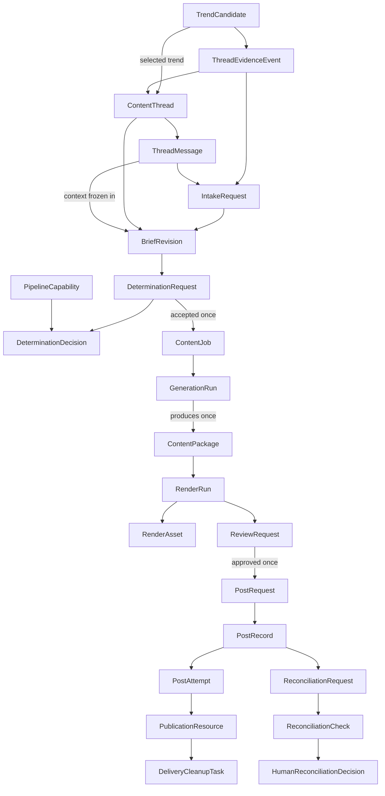

# Data Model Specification

**Document role:** Tier 2 target design contract. It defines required behavior;
verify implementation conformance from code and tests.
**Owner:** SQLite persistence, migrations, boundary models, and their tests.
**Read this for:** Schema, migrations, worker state, IDs, audit records, or any
change to a persisted handoff. Read [the system guide](../system.md) first.

SQLite is the authoritative state store. Every worker claims work from and
writes its result to SQLite. The dashboard reads its reporting view and writes
only the narrow human command records defined in the [dashboard specification](dashboard.md),
including an immediate `PostRequest` for **Post now**.

## Conventions and invariants

- Use `INTEGER PRIMARY KEY AUTOINCREMENT` for permanent audit identities;
  enable foreign keys for every connection. Audit IDs are never reused.
- Store timestamps as UTC ISO-8601 `TEXT`.
- Use JSON `TEXT` only for structured, pipeline-specific values and name it
  `*_json`. Keep identity, status, ordering, and audit data relational.
- Messages, evidence snapshots, creative packages, decisions, attempts, and
  published records are append-only. Rework creates a new revision; it never
  overwrites history.
- Enforce status sets with SQLite `CHECK` constraints and enforce transitions
  through transactional service methods plus boundary tests.
- Acquire work in one short conditional transaction. Every claim stores owner,
  claimed time, lease expiry, and a monotonic `claim_version` fencing token. Do
  network/LLM/filesystem work outside a transaction, then finalize in a second
  short transaction that still matches the claimed state, owner, and version.
- Claimable work distinguishes `retry_wait` from terminal `failed`, records
  attempt count/limit and `next_attempt_at`, and never lets an expired claimant
  commit after another worker has reclaimed the record.
- The production schema uses versioned forward migrations. It must refuse an
  unknown/incomplete/newer schema rather than silently apply additive changes.

## Relationship map

This is a persisted-record map, not a direct module-call diagram. The common
thread/revision lineage covers trend-originated and human-originated work.
Downstream records derive their thread/revision through foreign keys instead of
storing independently editable copies.

## Four identities

| Identity | Stored with | Meaning and uniqueness |
| --- | --- | --- |
| Evidence identity | Candidate/snapshot and determination decision | Fingerprint of normalized clustered evidence. It decides whether a trend with a prior `not_recommended` outcome materially changed. |
| Coverage identity | Content thread and determination decision | Route-neutral canonical editorial target. It prevents a second automatic thread for coverage that already exists and is available before pipeline selection. |
| Content identity | Accepted decision, job, generation run, and package | Coverage plus immutable revision ID, pipeline/destination/format, and recipe/content-contract version. It prevents duplicate automatic generation while allowing explicit human rework. |
| Publication identity | Post request and record | One explicit review-approval cycle for an exact package/render/destination. It permits at most one automatic final request while allowing a later, separately approved cycle only when review/reconciliation policy authorizes one. |

For O2, coverage identity uses the normalized teaching target. Content identity
adds immutable `revision_id`, `pipeline_id`, destination, format, and
recipe/content-contract version. A worker may not create a revision or add
randomness merely to bypass duplicate protection. Revisions arise only from an
explicit human rework, approved automatic evidence refresh, or migration.

## Detection evidence — retained and extended

Retain `trends`, `trend_observations`, `topic_snapshots`, `trend_history`,
`source_health`, `detection_runs`, and `trend_candidates`. They remain
deterministic source evidence, never human ideas or content threads.

Add `detection_source_instances` as the persisted source registry. It holds a
stable source-instance ID, source-kind/version, display name, endpoint/feed
URL, scope note, enabled state, expected cadence/measurement window, static
trust weight, safe configuration JSON/fingerprint, and audit timestamps.
`source_health` and every observation/run link to this record. A run stores the
exact enabled-source configuration snapshot it used; credentials never enter
the database.

Extend candidate/snapshot records with:

- `evidence_fingerprint`, `score_formula_version`, and
  `canonicalization_version`;
- normalized score breakdown and cluster membership linked to exact observation
  IDs;
- stable source-adapter/source-item IDs when a provider exposes them, canonical
  URL, provider timestamp, collection time, measurement window, and normalized
  activity; and
- candidate consumption and last determination outcome, last evaluated
  fingerprint, cooldown deadline, and shortlist policy/audit data: eligibility
  reason, rank, selected/deferred time, and selected thread ID.

Candidate eligibility uses an explicit closed state set rather than inferring
meaning from nullable timestamps: `eligible`, `selected`,
`deferred_by_budget`, `rejected_cooldown`, `reconsiderable`, `consumed`, and
`migration_hold`.
`selected` means an Intake request was durably created; `consumed` means an
accepted route already owns that automatic opportunity. A `not_recommended`
decision moves the candidate to `rejected_cooldown`. Expiry alone makes it
`reconsiderable`; it does not authorize duplicate content. Re-evaluation also
requires a materially different evidence fingerprint under the versioned
Detection policy.

`thread_evidence_events` records later evidence mapped to an existing coverage
identity. It stores the candidate/thread FKs, prior and current evidence
fingerprints, comparator version, materiality outcome/reason, frozen evidence
snapshot, resulting Intake-request FK when material, and timestamps. Any later
revision is reached through that immutable Intake-request lineage rather than
backfilled onto the event. This append-only record is the audit bridge for
evidence refresh. Material evidence continues the existing thread; it never
creates a duplicate thread.

`source_health` also records source instance, requested/actual measurement
window, item count, fallback mode, latency, and structured error category.
`detection_runs` retains Scout-run counts and errors. A selected candidate’s
exact evidence is copied into the first revision’s `source_snapshot_json`.

## Thread and revision records

### `content_threads`

| Column | Requirement |
| --- | --- |
| `thread_id` | Primary key. |
| `origin` | `trend`, `human`, or migration-only `legacy`. |
| `seed_candidate_id` | Nullable FK to `trend_candidates`; required for `trend`. |
| `coverage_identity` | Canonical editorial coverage key. Required and immutable once Revision 1 exists; unique when present. |
| `status` | `open`, `cancelled`, or `closed`. This is administrative, not worker state. |
| `created_at`, `updated_at`, `closed_at` | Audit timestamps. |

Enforce `origin != 'trend' OR seed_candidate_id IS NOT NULL` and
`UNIQUE(seed_candidate_id)`. A trend thread receives its coverage identity in
the same transaction that creates it. A human thread may begin without one,
but Idea Intake must assign it atomically with Revision 1; it is immutable
thereafter. A rework stays in its existing thread and creates another revision.
If a new subject cannot truthfully retain the existing coverage identity, it
requires an explicit new human thread. If a new trend maps to already consumed
coverage, retain it as evidence rather than opening a second automatic thread.

The POC uses a strictly linear revision history: a new revision must name the
current latest revision as parent. Only one non-terminal Intake request may
exist per thread.

### `thread_messages`

Append-only human/agent conversation.

| Column | Requirement |
| --- | --- |
| `message_id` | Primary key. |
| `thread_id` | Required FK to `content_threads`. |
| `sequence_number` | Positive; unique within its thread. |
| `author_kind` | `human`, `intake_agent`, or `system`. |
| `body` | Non-empty original text. |
| `in_reply_to_message_id` | Optional message FK. |
| `created_at` | Timestamp. |

Messages are context, not production instructions. The Idea Intake Agent uses
them to ask a question or freeze a revision.

### `intake_requests`

An Intake request is the durable handoff to the Idea Intake Agent. It contains
the thread FK, optional current/parent revision FK, optional first/last
input-message FKs (null for a trend event without a human message), frozen
request context/version, and status (`pending`, `claimed`,
`retry_wait`, `needs_clarification`, `completed`, `failed`, or `cancelled`). It
also records claim owner/time/lease/version, attempt count/limit,
`next_attempt_at`, safe error, result message/revision FKs, and audit
timestamps.

`needs_clarification` is terminal for that individual request (and therefore
not claimable), while the thread remains open awaiting a later human command.

Creating a human thread, its first message, and its first Intake request is one
transaction. Continuing a thread appends the human message and creates the
next Intake request in one transaction. A clarification response creates a
new request; the prior request remains `needs_clarification`. A completed
request creates exactly one revision and its pending Determination request in
the same transaction. An evidence-refresh event uses the same handoff and
references the event that caused it.

### `brief_revisions`

One immutable agreed brief per numbered version.

| Column | Requirement |
| --- | --- |
| `revision_id` | Primary key. |
| `thread_id`, `revision_number` | Required FK and positive number; unique pair. |
| `parent_revision_id` | Optional revision FK; must be in the same thread. |
| `input_through_message_id` | Last message considered; may be null only when no human message exists. |
| `brief_json` | Required normalized brief defined by the Idea Intake and Determination contract: editorial goal, topic, audience, desired outcome, constraints/preferences, and requested changes. |
| `source_snapshot_json` | Frozen candidate/detection evidence or original-conversation context. |
| `revision_reason` | `initial`, `human_rework`, `evidence_refresh`, or `migration`. |
| `created_by` | `intake_agent` or `system_migration`. |
| `source_intake_request_id`, `source_evidence_event_id` | The Intake request and optional evidence event that caused the revision. Migration is the only exception to the Intake-request requirement. |
| `created_at` | Freeze time. |

There is no editable draft revision. Conversation remains in messages until the
agent freezes the next immutable snapshot.

## Determination records

### `determination_requests`

This replaces trend-only `determination_handoffs`.

| Column | Requirement |
| --- | --- |
| `determination_request_id` | Primary key. |
| `revision_id` | Required unique FK: one evaluation per frozen revision. |
| `input_snapshot_json` | Exact brief, evidence, capability catalog, prompt/schema version sent to the evaluator. |
| `status` | `pending`, `claimed`, `retry_wait`, `completed`, `failed`, or `cancelled`. The decision outcome is stored separately. |
| `claim_owner`, `claimed_at`, `lease_expires_at`, `claim_version` | Fenced recovery metadata. |
| `attempt_count`, `attempt_limit`, `next_attempt_at` | Bounded retry metadata. |
| `created_at`, `completed_at`, `failure_reason` | Audit/recovery fields. |

### `determination_decisions`

One decision per request: `decision_id`, unique request FK, outcome
(`accepted`, `not_recommended`, or `blocked`), selected capability when one
exists, `recipe_json` for an accepted route, `reasoning`, `alternatives_json`,
warnings, evidence/coverage identities, and `created_at`. An interrupted worker
must not leave an accepted decision without its job: accepted decision,
Content Job, and completed request are committed in one transaction. A repair
path may create a unique missing job only for legacy or interrupted rows that
predate this invariant; it never evaluates that revision again. The full decision contract is in
[Idea Intake and Determination](idea-intake-and-determination.md).

## Production and rendering records

### `content_jobs`

One job exists only for an accepted decision. `determination_request_id` is a
required unique FK, replacing the current trend/candidate/handoff pointers.
It retains explicit pipeline, platform, account, format, allowed
renderer-profile set/selection policy, topic, angle, audience, objective, key
points, sources, priority, and status fields.

Status is `pending`, `claimed`, `running`, `retry_wait`, `completed`, `failed`,
or `cancelled`, with the common fenced-claim, bounded-retry, error, and
timestamp fields. `content_identity` is required and unique.

### `generation_runs`

One or more auditable generation attempts may exist for a job, but only one is
active at a time. It holds the job FK, pipeline/contract version, frozen recipe
input, claim/lease fields, status (`pending`, `claimed`, `running`,
`retry_wait`, `succeeded`, `failed`, `cancelled`), common fenced-claim and
bounded-retry fields, timestamps, safe failure category/text, current
checkpoint (`creative` or `metadata`), and immutable validated creative
snapshot JSON/hash.

A pipeline persists the validated creative snapshot before any dependent
metadata stage. This allows bounded metadata retries after restart without
regenerating accepted creative. `model_invocations` link each generation or
metadata call to the run. A successful run creates one immutable package;
creative change after package creation requires a new revision/job/run, never
an update to the prior run.

### `content_packages`

One immutable package exists per successful generation run
(`UNIQUE(generation_run_id)`) and remains unique per job. It contains:

- `content_package_id`, job FK, required generation-run FK,
  pipeline/destination/format identifiers;
- `creative_json`, caption, `tags_json`, `hashtags_json`, `sources_json`;
- versioned `visual_spec_json`, resolved renderer-owned profile/template
  ID/version/hash for every visual unit, generation model metadata,
  `content_hash`, and `created_at`. The reusable visual-spec contract is owned
  by [Visual Rendering](visual-rendering.md).

It has no mutable “ready for posting” status. Rendering and review are separate
records. A different creative result requires a new revision/job/package.

### `render_runs` and `render_assets`

`render_runs` holds package FK, renderer-provider ID/version, resolved
renderer-owned profile/template selection, frozen input/specification hash,
resolved font/asset input versions,
common fenced-claim and bounded-retry fields, status (`pending`, `claimed`,
`running`, `retry_wait`, `succeeded`, `failed`, `cancelled`), timestamps, safe
error category/text, and an output manifest. At most one run per package is
active. Safe retries create another run rather than overwrite assets.

`render_assets` holds run FK, `asset_role`, unique ordinal within role, local
path, MIME type, dimensions, bytes, SHA-256, conversion/encoder version, and
timestamp. Roles include `preview_html`, `preview_png`, and
`delivery_jpeg`; destination-specific references may add stricter roles. The
delivery JPEG is generated and verified locally and is canonical review input.
A successful complete run atomically freezes the output manifest and creates
one review request. R2 copies and signed delivery URLs are transport
derivatives, not canonical assets.

## Human review and delivery records

### `review_requests`

One review request exposes one exact package/render/destination review cycle:

- package and render-run FKs plus a positive review-cycle number, unique as a
  triple;
- required content-package hash and render-manifest hash copied at creation;
- status `awaiting_review`, `approved`, `changes_requested`, `rejected`,
  `invalidated`, `expired`, or `cancelled`;
- decision note, actor, decision time, and creation time.

Only one review request may be active per package/render/destination. Approval first revalidates
the package, manifest, asset hashes, policy freshness, and destination/profile
compatibility; it is terminal for that request and atomically creates one post
request plus its initial post record. `changes_requested` atomically appends a
human thread message and an Intake request for a new revision. Rejection is
terminal and preserves the creative/history. Any asset/package mutation or
superseding revision invalidates the request; creative change always starts a
new revision.

### `post_requests`, `post_records`, and `post_attempts`

`post_requests` is immutable human authorization: unique review FK,
package/render FKs and approved hashes, destination, `delivery_mode`
(`immediate` only in the initial POC), request time, status (`approved`,
`cancelled`, `fulfilled`), publication identity, and audit timestamps. It is
not worker-claimable. The initial POC does not persist a human-requested
delivery time or schedule.

`post_records` is the external delivery lifecycle: unique request FK,
policy-derived `eligible_at`, status (`pending`, `claimed`, `publishing`,
`retry_wait`, `failed`, `published`, `publication_unknown`, `cancelled`), the
common fenced-claim/bounded-retry fields, external post ID, final timestamps,
and typed error.
`publication_unknown` is terminal until human reconciliation, never automatic
retry.

`delivery_mode=immediate` records the human's requested urgency; the active
posting policy still owns the computed `eligible_at`. The architecture does
not infer whether immediate mode bypasses cadence. If the versioned policy does
not explicitly answer that question, creation/delivery is blocked rather than
guessed.

`post_attempts` has a record FK, unique attempt number, start/completion,
status, typed error, and `final_publication_request_sent_at`. Create it before
the external call. Once that final request may have been transmitted, an absent
response cannot be treated as a safe retry.

### `publication_resources` and `delivery_cleanup_tasks`

`publication_resources` generalizes Instagram containers: attempt FK, optional
asset ordinal, resource type (`staged_media`, `carousel_child`,
`carousel_parent`, or later platform type), remote/object ID, status, safe
metadata, and timestamps. Never retain tokens or signed URLs.

`delivery_cleanup_tasks` owns R2 cleanup: resource FK, object key, status
(`pending`, `claimed`, `retry_wait`, `succeeded`, `failed`, `cancelled`), the
common fenced-claim/bounded-retry fields, error, and timestamps. Cleanup
failure stays visible but does not change a confirmed post to failed.

### Reconciliation records

`reconciliation_requests` is the durable operator/agent work item for one
`publication_unknown` Post Record. It stores reason, status (`pending`,
`claimed`, `retry_wait`, `needs_human`, `resolved`, `failed`, `cancelled`), the
common fenced-claim/bounded-retry fields, and audit timestamps. At most one is
active per Post Record.

Each external inspection creates an append-only `reconciliation_check` with
request FK, provider query/matching-rule version, safe response summary/hash,
candidate external IDs, outcome (`confirmed_published`,
`confirmed_not_published`, `ambiguous`, or `provider_unavailable`), and time.
Automation may resolve only an unambiguous published match. A
`human_reconciliation_decision` records actor, exact check/evidence considered,
decision (`published`, `not_published_cancel`, or `leave_unknown`), note, and
time. No reconciliation path silently retries the final publication call.

## Cross-cutting records

- `pipeline_capabilities` is the persisted enabled capability catalog.
  It has a stable capability ID, pipeline/platform/account/format/visual-profile
  identifiers, contract version, `enabled` state, supported goals/audiences and
  input constraints JSON, deterministic priority/tie-break metadata, safe
  dependency/configuration requirements, and audit timestamps. It does not
  store credentials. A determination request freezes the exact applicable
  catalog snapshot rather than relying on a later mutable lookup.
- `posting_policies` remains keyed by pipeline/platform/account with daily and
  interval limits.
- `human_command_receipts` provides command idempotency and audit for dashboard
  writes: unique client command ID, command kind, durable actor identifier,
  short-lived local browser-session identifier where applicable, target
  record/version, safe payload hash, result-record references, and timestamp.
  The POC records `local_owner` for every dashboard command. Repeating the same
  ID/payload returns the original result; reusing it with different input is
  rejected.
- `model_invocations` replaces ambiguous `api_usage`: phase, applicable entity
  FKs including `generation_run_id`, attempt ordinal, request/prompt/schema
  version and safe request hash, model/provider request ID, response hash,
  tokens/cost, outcome (`started`, `succeeded`, `transport_failed`,
  `invalid_output`, `parse_failed`, `schema_failed`), safe error, start time,
  and completion time. Insert and commit `started` before the provider call;
  finalize that row immediately after response or transport failure and before
  interpreting output. A stale `started` row is an uncertain-cost audit event,
  not evidence that no call occurred.
- `worker_heartbeats` keeps one current health row per worker instance: worker
  type, instance ID, start/last-seen time, state, current claim reference, build
  version, and safe health summary. Heartbeats update this row rather than
  generating append-only noise.
- `worker_runs` is append-only and records only substantive invocations that
  claim or process work: worker name/instance, claimed entity, start/end,
  status, and safe summary/error. It complements—not replaces—per-item
  state/leases and the current heartbeat row.
- `schema_migrations` stores forward migration version/name/time/checksum.

## Required constraints and indexes

Use primary/foreign keys plus the named unique constraints. Required polling and
reporting indexes include:

- `detection_source_instances(enabled, source_kind, stable_id)`;
- `trend_candidates(status, cooldown_until, evidence_fingerprint)` and cluster
  membership;
- `thread_evidence_events(thread_id, created_at)` and current fingerprint;
- unique trend-thread coverage identity;
- `pipeline_capabilities(enabled, priority, pipeline_id)`;
- `intake_requests(status, next_attempt_at, created_at)`;
- `determination_requests(status, created_at)`;
- `content_jobs(status, priority DESC, created_at)` and unique content identity;
- `generation_runs(status, created_at)`;
- `render_runs(status, created_at)`;
- `review_requests(status, created_at)`;
- unique post-request publication identity;
- `post_records(status, eligible_at, next_attempt_at)`;
- `reconciliation_requests(status, next_attempt_at, created_at)`;
- `delivery_cleanup_tasks(status, lease_expires_at)`;
- `thread_messages(thread_id, sequence_number)`;
- `brief_revisions(thread_id, revision_number)`;
- `model_invocations(thread_id, revision_id, created_at)`;
- `model_invocations(generation_run_id, created_at)`; and
- unique `human_command_receipts(client_command_id)`.

Service methods also validate parent state: review requires complete verified
assets; post request requires approval; post attempt requires a claimable
record; a resource belongs to its creating attempt.

## Migration and cutover

The durable target uses forward-only migrations and preserves persisted SQLite
handoffs/history. For the current pre-production architectural reset only, an
explicit operator-run development rebuild is approved because no production
data exists. That rebuild must name and display the exact database path, refuse
to run from worker/dashboard startup, offer a timestamped backup, and require a
separate deliberate command. Once the target baseline is established, all
normal changes use the forward migration sequence below.

1. Stop workers, back up SQLite, enable foreign keys, verify a supported
   starting schema, and record the first migration version.
2. Add target tables/indexes without deleting current tables. Keep detector
   evidence unchanged and add Intake/evidence-event/reconciliation/model-call
   audit structures.
3. Backfill each handoff into a `legacy`/`trend` thread, Revision 1, request,
   decision, job, generation run, and package lineage. Jobs without a handoff
   receive legacy lineage.
4. Backfill each package into a succeeded legacy generation run. Existing
   render outputs that do not meet the canonical final-JPEG manifest contract
   require a new pending render run; do not approve them by inference.
5. Backfill published delivery history into request/record/attempt/resource and
   cleanup audit rows. Do not publish during migration. Place every old
   unpublished queued/retry/failed item on migration hold and expose it as
   awaiting review; no approval is inferred.
6. Deploy target-table workers. Keep old tables read-only until record counts,
   foreign-key integrity, hashes, and dashboard traces reconcile. Archive or
   remove obsolete tables only in a separate approved migration.
7. Test constraints, concurrency, revision immutability, safe recovery,
   approval/cancellation, publication uncertainty, and migration safety.

No worker or dashboard start path resets or silently accepts an incompatible
database.
