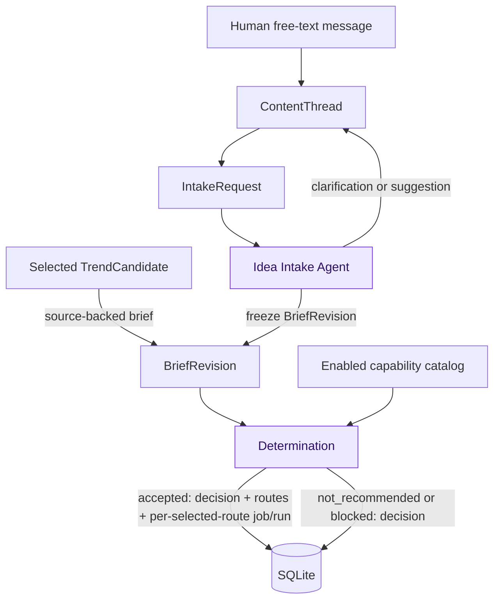

# Idea Intake and Determination Specification

**Document role:** Tier 2 target design contract. It defines required editorial
planning behavior; verify implementation conformance from code and tests.
**Owner:** Human free-text intake, `ContentThread`, `BriefRevision`, capability
catalog, AI decisioning, and determination acceptance tests.
**Read this for:** Human ideas, rework, clarification, brief freezing,
capability registration, pipeline selection, Gemini decisioning, or
determination outcomes. Read [the system guide](../system.md) first, then the
[data model](data-model.md), [dashboard](dashboard.md), and [runtime](runtime.md)
contracts for their respective boundaries.

## Two distinct workers, one specification

This specification covers two separate editorial workers that share a common
planning boundary:

1. **Idea Intake Agent** — claims human-origin `IntakeRequest`s, interprets
   conversation, freezes immutable `BriefRevision`s, and assigns coverage
   identity when clarification or revision is needed.
2. **Determination Worker** — claims `DeterminationRequest`s, evaluates frozen
   briefs against the five-domain catalog, produces decisions with five route
   dispositions, and creates `ContentJob`s for selected routes.

They communicate only through SQLite. Human Idea Intake produces
`BriefRevision` + `DeterminationRequest`; Detection creates the same two records
directly for a selected trend. Determination consumes both kinds of request.
Idea Intake is therefore optional for trend-origin work and remains separate
because human conversation may require clarification or rework.

## Purpose and boundary

This specification converts two kinds of editorial opportunity into a safe,
auditable production decision:

- a selected `TrendCandidate` with frozen detection evidence; or
- a human's unconstrained free-text conversation in the dashboard.

It does not require a human form and it does not generate creative content.
Detection creates a minimal source-backed `BriefRevision` for a selected trend;
Idea Intake interprets human conversation into a richer brief when needed.
Determination evaluates either frozen brief against the five-domain catalog and
separately determines domain fit and a credible angle. Only selected routes
create jobs; one revision may create zero to five jobs.



Both agents communicate only through SQLite records. Neither calls a pipeline,
renderer, dashboard action, or social API directly.

### Human-idea success path

The desired human experience is a durable editorial conversation: a person can
offer an incomplete idea, receive one focused clarification when needed, reply
in the same thread, and refine the idea again after a brief or decision exists.
Each actionable turn creates a new immutable `BriefRevision`; it never rewrites
an earlier brief, decision, job, or package. The latest revision proceeds to
Determination and, when selected, to the same content-production flow used by a
trend. A continuation command persists only the message plus its pending
`IntakeRequest`; it never invokes Gemini or downstream work synchronously.

## Human free-text intake and revision policy

A human may submit free-form text within the operational-data size limits. There are no required input
fields. The dashboard transaction appends the message and creates a durable
`IntakeRequest`; the agent claims that request, reads the ordered conversation
through its frozen input boundary, and may infer a working target, audience,
and preferences from natural language.

1. If the instruction is actionable, Intake records a concise agent summary and
   freezes the next immutable `BriefRevision`.
2. If a material ambiguity prevents a responsible brief, Intake records one
   concise clarification question or concrete suggestion and marks that
   request `needs_clarification`. It creates no revision and no determination
   request. A later human reply creates a new durable Intake request.
3. Intake never silently discards an idea. A thread awaiting a response remains
   visible in the dashboard with its latest question or suggestion.
4. A direct human instruction is sufficient agreement to freeze a brief unless
   it is materially ambiguous. The human can always continue the same thread.
5. A later instruction creates Revision 2, Revision 3, and so on. No prior
   revision, decision, job, package, review, or post is edited.

Revision history is linear in the POC: every new revision names the current
latest revision as parent, and a thread has at most one non-terminal Intake
request. Creating a human thread/message/request, and appending a continuation
message/request, are transactional dashboard operations. Completing Intake
atomically creates the immutable revision and its pending Determination
request; there is no untracked in-memory handoff.

### Editorial coverage identity and collision — `coverage_normalization_v2`

Detection's `trend:<canonicalization_version>:<cluster_key>` is an opportunity
identity, not editorial coverage. For a detected trend, the shortlist derives
the thread's route-neutral editorial coverage identity from the deterministic
source brief. For a human idea, Idea Intake derives it while freezing Revision 1.
Both use the normalized brief tuple:

```text
coverage:<coverage_normalization_version>:<coverage_kind>:<canonical_target>
```

`coverage_kind` and `canonical_target` are required fields in the frozen brief.
The identity serializer applies Unicode NFKC, Unicode case folding, trimming,
whitespace collapse, and percent-encoding of the two components in that order.
It is deterministic; Gemini may propose the structured brief fields, but does
not generate the identity by an unstructured string guess. A trend brief uses
the editorial event/subject, not a prematurely selected English expression.
Human language-teaching ideas may naturally use a language subject. Tone, hook,
platform, destination, and visual style never create a different coverage.
Pipeline-specific angle/teaching-target deduplication happens after routing and
is separate from the shared thread identity.

The same transaction checks the unique non-null identity on `ContentThread`:

- If no owner exists, it assigns the identity, creates Revision 1, and creates
  the pending Determination Request normally.
- For a trend seed collision, it appends the candidate's frozen evidence as a
  `ThreadEvidenceEvent` to the existing owning thread, closes the unused seed
  thread with reason `coverage_collision_merged`, and creates a new direct
  Determination request on the owner only when the normal material-evidence rule
  permits it.
  The candidate and its seed lineage remain auditable.
- For a human seed collision, it records an Intake-agent message directing the
  human to continue the existing thread, then closes the unused seed thread
  with the same reason. It creates no duplicate revision or job.

An explicit qualifier may permit a distinct new coverage only when it is part
of the submitted/frozen editorial subject and changes the canonical target
itself. It cannot be a different tone, format, account, or wording workaround.
The POC has no separate qualifier syntax; a materially different subject gets
a different `canonical_target` or Intake asks for clarification.

Selected trends use the same thread/revision model, but do not require an Intake
worker. Detection creates Revision 1 when the frozen evidence is sufficient. A
human can later continue that thread and create an intentional rework revision.
After a trend is `not_recommended`, a material evidence change approved by the
deterministic recurrence policy creates a `ThreadEvidenceEvent` and direct
Determination request on the same thread. A resulting revision uses
`revision_reason=evidence_refresh`.

### Thread closure, cancellation, and route re-evaluation

An open thread may be **closed** only after all of its unfinished work has
reached a terminal state. Closing archives the thread; it does not edit or
cancel any historical result. The dashboard must require an explicit reopen
before accepting another human message. Reopening creates no revision or model
call by itself; the later message follows the normal Intake path.

An open thread may be **cancelled** when the human wants to abandon unfinished
work. The cancellation transaction records the durable actor/reason, changes
the thread status, and cancels every unclaimed or retry-wait descendant that
has not reached an external side-effect boundary: Intake and Determination
requests, Generation Runs, Adaptation Runs, Render Runs, and awaiting-review
requests. It also cancels an approved Post Request/Post Record only while its
final publication request has not been marked sent. Immutable revisions,
decisions, canonical content, output requests, packages, assets, rejected/failed history, published posts, and
`publication_unknown` records are never deleted or rolled back.

A worker with an already claimed local item may finish only its bounded current
operation. Before it creates a downstream handoff or commits an accepted
Determination decision, package, review request, or delivery attempt, it checks
the thread cancellation state in its fenced finalization transaction. A
cancelled thread makes that finalization `cancelled` instead. Once the final
platform-publication marker may have been sent, that delivery descendant is
excluded from cancellation and the Posting Agent safety rules govern the
resulting post or uncertain publication. Other unfinished descendants may still
be cancelled safely.

`blocked` is a route/dependency outcome, not an editorial rejection. The
dashboard shows the specific blocker and may offer **Re-evaluate route** only
when all of the following are true:

1. the decision with at least one blocked route belongs to the thread's latest revision and the thread
   is open;
2. no non-terminal Intake or Determination request exists for that thread; and
3. the safe routing-input fingerprint has changed since that route assessment.

The fingerprint covers the enabled capability catalog, the persisted
capability-readiness release fingerprint/status/reasons, and routing-policy
version and relevant prior-work status/hash for duplicate/reuse blockers, but
no secret values. The command
creates an immutable `capability_recheck` revision with the exact same brief
and source context, names the prior decision and specific blocked routes, freezes the new routing
input, and creates one pending Determination request in one transaction. It
does not require a human message, invoke Gemini directly, or re-evaluate the
old revision. Scope the recheck to previously blocked routes; already selected
or completed routes are reused, never regenerated as collateral fan-out. If the
fingerprint did not change, reject the command without a model call.

## Normalized brief contract

`brief_json` is an internal agent-produced record, not a dashboard form. A
frozen revision must contain:

| Field | Requirement |
| --- | --- |
| `editorial_goal` | Required plain-language statement of what the content should accomplish. |
| `topic` | Required route-neutral normalized editorial subject. |
| `coverage_kind`, `canonical_target` | Required structured coverage inputs; no platform/account identity. |
| `revision_scope` | Whole brief, named domains, or exact output-request rework; includes parent lineage and human intent. |
| `audience` | Required intended audience; an explicit reasonable default is allowed when supported by the thread/evidence. |
| `desired_outcome` | Required result, such as teach, explain, entertain, or inform. |
| `constraints` | Required object, possibly empty: must-include, avoid, tone, factual limits, platform/format preferences, and requested changes. |
| `source_context` | Required concise source-neutral summary. Detailed trend evidence and conversation remain in the immutable source snapshot, not duplicated here. |
| `open_questions` | Required list. It must be empty before the revision is sent to Determination. |

The agent may add non-authoritative presentation fields, but it must not use
them for eligibility, identity, or routing. Changes to the required fields or
their meaning require a data-model migration and boundary tests.

## Domain catalog and output bindings

Determination freezes the five-domain catalog from
[Domain pipelines](../pipelines/domains.md), explicit enabled states, domain
contract/model policy versions, safe generation readiness, configured output
bindings, and current output readiness. Pipeline IDs are domain-only. Platform,
account, format, output-contract version, and compatible profiles belong to
separate output bindings in [Configuration](configuration.md).

Catalog membership does not mean implementation is enabled. Every decision
accounts for all five domains, including disabled or out-of-scope ones. It may
select only an enabled registered domain with at least one explicitly configured,
ready output binding and ready domain generation prerequisites. An unknown
account, unverified output contract, or stale readiness is never guessed.
Temporary capacity shortage is not a routing blocker.

## Determination policy and outcomes

The structured decision makes these separate judgments:

1. Is the opportunity worth creating content about, given audience value,
   evidence, timeliness, safety, novelty, and any qualified monetization potential?
2. Which domains have a credible connection? Record fit and reasons for each.
3. For each fitting domain, what distinct angle, audience, thesis, and reader
   outcome are supported? Pipeline fit alone is insufficient.
4. Which configured outputs are eligible, and which are skipped or blocked?
5. Does the duplicate/cost/readiness guard permit new work?

Trend importance does not require all domains to respond. A shopping-agent
launch may justify several domains; an unrelated expression or unsupported
psychological mechanism should be skipped. No slides, captions, hashtags, or
final post text are generated during Determination.

### Angle contract — `domain_angle_v1`

An angle is an immutable structured part of a route: `angle_kind`,
`canonical_target`, `audience`, `thesis`, `reader_value`,
`evidence_reference_ids`, `qualification`, and `why_this_domain`.
The domain-angle identity serializes pipeline ID, angle kind, and canonical
target with the same NFKC/casefold/trim/whitespace/percent-encoding rules as
coverage. It excludes platform, account, hook wording, and formatting.

The canonical target includes a meaningful event/as-of or sense qualifier when
that changes the actual subject. English teaching targets include expression/
word and intended sense; a second trend teaching the same sense is not new
content merely because its source headline changed. Other domains must not
evade duplicate prevention by renaming the same claim or thesis. Deterministic
identity is an exact guard, not proof of semantic novelty: compare proposed
angles with retained same-domain coverage, include bounded relevant prior
summaries in routing input, and expose uncertain equivalence for human review.
Detection's local event resolver handles source-event identity, not editorial
novelty or angle reuse. It uses no vector database; see
[Detection](detection.md#semantic-event-resolution).

Phase 1 selects at most one angle per domain per revision. Different selected
domains must offer substantively different reader value; changing the hook of
the same summary five times is invalid fan-out. Persist the angle before any
generation cost is admitted.

### Per-domain and aggregate results

Each `DeterminationRoute` records domain, editorial fit, reason, angle when
applicable, evidence, warnings, output assessments, and one disposition:

| Route disposition | Meaning and consequence |
| --- | --- |
| `selected` | Credible, enabled, nonduplicate angle and at least one ready configured output. Create exactly one domain ContentJob and first GenerationRun. |
| `skipped` | Weak link, no reader value, insufficient claim support for a credible angle, unsafe angle, explicitly excluded/disabled domain, or deliberate editorial rejection. Record a specific reason; no job. |
| `blocked` | A credible angle exists but a required generation/reference/output dependency is unavailable. Record remedy; no job. |
| `reused` | The unchanged domain-angle/creative input already has a validated successful canonical record. Reference it, create no duplicate generation, and never reopen prior approval. |

`skipped` for a disabled domain must retain editorial fit as `not_evaluated`
rather than claiming the domain was a weak fit. Missing evidence that prevents
even a credible angle is an editorial skip; a supported intended angle missing
an approved reference/configuration prerequisite is an operational block.
An invalid provider/model response is worker failure, never fabricated skips.

| Aggregate outcome | Deterministic rule |
| --- | --- |
| `accepted` | At least one selected or reusable route; other domains may be skipped/blocked. A reuse-only decision explicitly reports zero new jobs. |
| `blocked` | No selected/reused route and at least one credible blocked route. |
| `not_recommended` | No selected/reused/blocked route; all domains skipped, with whole-opportunity reason. |

An unchanged prior job still running is a `blocked` route with reason
`prior_work_in_progress`; a failed prior job without canonical content is
`blocked` with `prior_work_recovery_required`. Link it and use its existing
recovery path; do not declare nonexistent canonical content reused or create a
replacement job to evade its cost history.

The aggregate is derived from validated route rows, not an independent model
guess. A whole-trend rejection still records all five dispositions. A domain
may be selected for Instagram while its X binding is blocked; only explicitly
eligible outputs enter that job's frozen plan. Unbound/newly enabled outputs are
not later backfilled automatically. The production contract defines safe reuse
and explicitly scoped rework.

For trend-origin decisions, any accepted route consumes the candidate once.
Skipped siblings are not newly injected after three days. Only an all-editorial
`not_recommended` result follows the 72-hour plus material-evidence recurrence
rule. A blocked result awaits explicit recheck or human continuation.
Human-origin rejection is visible feedback on the same thread, never a discard.

An accepted job may start `waiting_capacity`; admission owns paid execution.
Human-origin priority does not preempt existing reservations.

## Decision record, model accounting, and recovery

A frozen revision has at most one request and one immutable decision. The
request freezes the revision/evidence, catalog, relevant prior-angle summaries,
readiness fingerprint, rework scope, and model/prompt/schema versions. It is not
re-evaluated to obtain a different answer.

One fenced transaction completes the request, persists the decision and exactly
five domain route rows, and creates all selected-route jobs and their first
runs. Uniqueness is per selected route, not per DeterminationRequest. A
transaction failure creates no partial fan-out. Reclaimed/repeated completion
returns the same rows. A selected route cannot exist without its job/run; a
skipped/blocked route cannot own a new job. Reused routes reference prior work.

Every Gemini call uses the ledger/reservation rules in
[Reliability](reliability.md), including failed validation and uncertain cost.
Persist safe response metadata before schema/semantic validation; never full
prompts, raw responses, credentials, or unbounded context. No-work and
unchanged-input recheck paths make no model call.

## Dashboard requirements

Show one decision summary with five expandable domain rows: fit, disposition,
angle, rationale, skip/block reason, evidence, eligible/skipped output bindings,
and selected/reused job links. Separate editorial rejection, operational
readiness, capacity wait, and technical failure. Render canonical content once
with child output branches, not five unrelated copies of a trend. Scope change
requests to the exact branch/domain or common brief.

## Acceptance requirements

Tests and an operator-reviewed routing fixture set must demonstrate:

- free-text Intake, bounded input, clarification/resumption, human/trend parity,
  immutable linear revisions, and coverage collision behavior;
- exactly one selected domain, multiple selected domains with distinct angles,
  an intentionally skipped weak domain, and entire-trend rejection;
- every one of the five domains represented, with no minimum production quota;
- mixed selected/skipped/blocked outcomes and aggregate consistency;
- unavailable, disabled, unbound, stale, and capacity-limited cases remaining
  distinguishable;
- duplicate evidence, renamed duplicate angles, and repeated input not causing
  another paid generation or confirmed/uncertain publication;
- atomic zero-to-five job fan-out and fenced/idempotent request completion;
- recheck of blocked siblings preserving completed work;
- scoped output rework reusing unchanged canonical content;
- cancellation stopping only authorized unfinished descendants; and
- invalid model output or provider failure recorded as failure, not rejection.

The opt-in worker uses closed in-code response schemas, persisted v2 creative
tables, and fake-client boundary tests. Synthetic mode evaluates five
non-deliverable capabilities; v4 production mode freezes real enabled/readiness
bindings and applies priced admission to Intake and Determination calls. Exact
standalone multi-route/angle/rework JSON artifacts, capacity/reuse enforcement,
and operator-reviewed semantic routing fixtures remain required before
unattended production acceptance. The old single-route
`determination_result_v1`, `recipe_v1`, and the old `brief_v1` draft are
superseded; see [contract maturity](../contracts/maturity.md).
