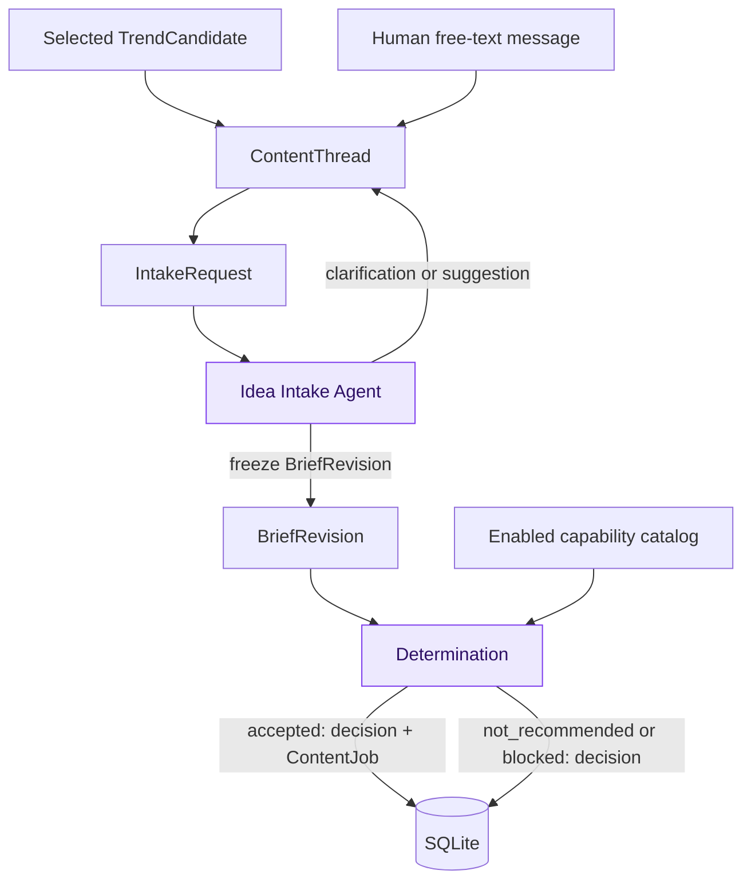

# Idea Intake and Determination Specification

**Document role:** Tier 2 target design contract. It defines required editorial
planning behavior; verify implementation conformance from code and tests.
**Owner:** Human free-text intake, `ContentThread`, `BriefRevision`, capability
catalog, AI decisioning, and determination acceptance tests.
**Read this for:** Human ideas, rework, clarification, brief freezing,
capability registration, pipeline selection, Gemini decisioning, or
determination outcomes. Read [the system guide](../system.md) first, then the
[data model](data-model.md), [dashboard](dashboard.md), and [runtime](runtime.md)
contracts for their respective boundaries.

## Purpose and boundary

This specification converts two kinds of editorial opportunity into a safe,
auditable production decision:

- a selected `TrendCandidate` with frozen detection evidence; or
- a human's unconstrained free-text conversation in the dashboard.

It does not require a human form and it does not generate creative content.
Idea Intake turns conversation or trend context into an immutable
`BriefRevision`. Determination evaluates that frozen revision against the
enabled capability catalog and, only when appropriate, creates a `ContentJob`.



Both agents communicate only through SQLite records. Neither calls a pipeline,
renderer, dashboard action, or social API directly.

## Human free-text intake and revision policy

A human may submit any amount or style of text. There are no required input
fields. The dashboard transaction appends the message and creates a durable
`IntakeRequest`; the agent claims that request, reads the ordered conversation
through its frozen input boundary, and may infer a working target, audience,
and preferences from natural language.

1. If the instruction is actionable, Intake records a concise agent summary and
   freezes the next immutable `BriefRevision`.
2. If a material ambiguity prevents a responsible brief, Intake records one
   concise clarification question or concrete suggestion and marks that
   request `needs_clarification`. It creates no revision and no determination
   request. A later human reply creates a new durable Intake request.
3. Intake never silently discards an idea. A thread awaiting a response remains
   visible in the dashboard with its latest question or suggestion.
4. A direct human instruction is sufficient agreement to freeze a brief unless
   it is materially ambiguous. The human can always continue the same thread.
5. A later instruction creates Revision 2, Revision 3, and so on. No prior
   revision, decision, job, package, review, or post is edited.

Revision history is linear in the POC: every new revision names the current
latest revision as parent, and a thread has at most one non-terminal Intake
request. Creating a human thread/message/request, and appending a continuation
message/request, are transactional dashboard operations. Completing Intake
atomically creates the immutable revision and its pending Determination
request; there is no untracked in-memory handoff.

Selected trends use the same thread/revision model. Intake may freeze a
trend-seeded Revision 1 without a conversational question when the frozen
evidence is already sufficient. A human can later continue that thread and
create an intentional rework revision. After a trend is `not_recommended`, a
material evidence change approved by the deterministic recurrence policy
creates a `ThreadEvidenceEvent` and Intake request on the same thread. A
resulting revision uses `revision_reason=evidence_refresh`.

### Thread closure, cancellation, and route re-evaluation

An open thread may be **closed** only after all of its unfinished work has
reached a terminal state. Closing archives the thread; it does not edit or
cancel any historical result. The dashboard must require an explicit reopen
before accepting another human message. Reopening creates no revision or model
call by itself; the later message follows the normal Intake path.

An open thread may be **cancelled** when the human wants to abandon unfinished
work. The cancellation transaction records the durable actor/reason, changes
the thread status, and cancels every unclaimed or retry-wait descendant that
has not reached an external side-effect boundary: Intake and Determination
requests, Content Jobs/Generation Runs, Render Runs, and awaiting-review
requests. It also cancels an approved Post Request/Post Record only while its
final publication request has not been marked sent. Immutable revisions,
decisions, packages, assets, rejected/failed history, published posts, and
`publication_unknown` records are never deleted or rolled back.

A worker with an already claimed local item may finish only its bounded current
operation. Before it creates a downstream handoff or commits an accepted
Determination decision, package, review request, or delivery attempt, it checks
the thread cancellation state in its fenced finalization transaction. A
cancelled thread makes that finalization `cancelled` instead. Once the final
platform-publication marker may have been sent, that delivery descendant is
excluded from cancellation and the Posting Agent safety rules govern the
resulting post or uncertain publication. Other unfinished descendants may still
be cancelled safely.

`blocked` is a route/dependency outcome, not an editorial rejection. The
dashboard shows the specific blocker and may offer **Re-evaluate route** only
when all of the following are true:

1. the blocked decision belongs to the thread's latest revision and the thread
   is open;
2. no non-terminal Intake or Determination request exists for that thread; and
3. the safe routing-input fingerprint has changed since the blocked decision.

The fingerprint covers the enabled capability catalog, dependency/configuration
readiness, and routing-policy version, but no secret values. The command
creates an immutable `capability_recheck` revision with the exact same brief
and source context, names the prior blocked decision, freezes the new routing
input, and creates one pending Determination request in one transaction. It
does not require a human message, invoke Gemini directly, or re-evaluate the
old revision. If the fingerprint did not change, the command is rejected rather
than spending another model call on the same blocked route.

## Normalized brief contract

`brief_json` is an internal agent-produced record, not a dashboard form. A
frozen revision must contain:

| Field | Requirement |
| --- | --- |
| `editorial_goal` | Required plain-language statement of what the content should accomplish. |
| `topic` | Required normalized subject or teaching target. |
| `audience` | Required intended audience; an explicit reasonable default is allowed when supported by the thread/evidence. |
| `desired_outcome` | Required result, such as teach, explain, entertain, or inform. |
| `constraints` | Required object, possibly empty: must-include, avoid, tone, factual limits, platform/format preferences, and requested changes. |
| `source_context` | Required concise source-neutral summary. Detailed trend evidence and conversation remain in the immutable source snapshot, not duplicated here. |
| `open_questions` | Required list. It must be empty before the revision is sent to Determination. |

The agent may add non-authoritative presentation fields, but it must not use
them for eligibility, identity, or routing. Changes to the required fields or
their meaning require a data-model migration and boundary tests.

## Enabled capability catalog

Determination can choose only a capability explicitly enabled in the persisted
catalog. A capability record declares at least:

- stable `pipeline_id`, platform, account, format, allowed renderer-profile
  set/selection policy, and contract version;
- supported editorial goals, audience/subject constraints, and format limits;
- required configuration/dependencies and current enablement state; and
- priority/tie-break metadata that is deterministic when otherwise equal.

O2 English Instagram is initially the sole enabled capability. The catalog is
deliberately multi-pipeline so a future capability is registered as data and
contract, not by changing Determination's basic decision model.

## Determination policy and outcomes

Determination evaluates a frozen revision against every enabled capability. It
considers editorial value, audience fit, platform/format fit, visual/rendering
availability, duplicate/coverage risk, source quality where relevant, and
configuration or policy constraints. It does not generate slides, captions,
hashtags, or other creative content.

The Gemini call receives a frozen revision, applicable source evidence, and a
snapshot of the enabled capability catalog. Its structured result is validated
before any decision is persisted. An invalid or failed model response is a
worker failure, not an invented decision.

| Outcome | Meaning | Persisted consequence |
| --- | --- | --- |
| `accepted` | One capability is suitable and safe to run. | Persist decision and exactly one `ContentJob` with the selected executable recipe. |
| `not_recommended` | The idea is understandable but no route is editorially worthwhile now. | Persist decision, rationale, alternatives, and revision suggestions; no job. |
| `blocked` | A suitable route exists but cannot run because capability, configuration, policy, or dependency is unavailable. | Persist decision, specific blocking reason, and required remedy; no job. |

For human-originated work, `not_recommended` is editorial feedback, not a
discarded request. The dashboard offers continuation of the same thread. For a
trend, a `not_recommended` result is subject to the detection recurrence policy.

For `blocked`, the dashboard offers **Continue this thread** for editorial
rework and, only when the route-input preconditions above hold,
**Re-evaluate route**. These actions have distinct audit trails and must not be
substituted for one another.

When more than one capability fits, select the strongest valid route and persist
ranked alternatives and tie-break reasoning. Determination may never route to a
disabled or unregistered capability.

## Decision record, model accounting, and recovery

Each frozen revision has at most one `DeterminationRequest` and one
`DeterminationDecision`. The request captures the exact revision, evidence,
catalog snapshot, model/prompt/schema versions, and claim state. The decision
stores outcome, selected capability when applicable, executable recipe only for
`accepted`, rationale, alternatives, warnings, evidence/coverage identities,
and timestamp.

Create and commit the model-invocation ledger row as `started` before every
provider call. Finalize that same row immediately after a response or transport
failure and before output parsing or validation. It records request/schema
version and safe hashes, tokens/cost when known, provider request ID when
available, and safe outcome including invalid output and transport failure;
never persist credentials or full provider prompts/responses.

An interrupted worker resumes the same request subject to its fenced claim. An
accepted decision, unique Content Job, and completed request are committed in
one transaction. The missing-job repair path exists only for legacy rows that
predate that invariant. A frozen revision is never re-evaluated to get a
different answer.

## Dashboard requirements

The dashboard shows one chronological editorial trace:

```text
conversation or trend evidence
  → clarification/suggestion, if any
  → frozen BriefRevision
  → capability snapshot and DeterminationDecision
  → accepted ContentJob, or feedback/blocker for the next revision
```

For every decision, show its outcome, selected capability, rationale, ranked
alternatives, warnings, model-use summary, and links to the underlying revision
and resulting job. A `not_recommended` or `blocked` result exposes a
**Continue this thread** action; it never provides a hidden automatic retry.

## Acceptance requirements

Implementation and boundary tests must demonstrate:

- short, detailed, and ambiguous human free-text ideas;
- one concise clarification path that creates no revision until resolved;
- selected-trend and human-originated threads using the same revision lineage;
- durable Intake claims, clarification resumption, and duplicate-submit safety;
- Revision 2 never mutates Revision 1 or any past decision/job/package;
- closing, reopening, and cancellation preserve historical records and stop
  only the permitted unfinished descendants;
- a cancellation race cannot send a final publication request after the
  cancellation transaction wins, and cannot roll back a possible publication;
- a blocked decision can create one auditable capability-recheck revision only
  after routing inputs change, without a human message or re-evaluation of the
  old revision;
- only registered enabled capabilities are selectable;
- no suitable capability produces `not_recommended` and no job;
- unavailable capability/configuration produces `blocked` and no job;
- duplicate claims/restarts cannot create two decisions or two jobs; and
- invalid model output, parse/schema failure, and provider failure are
  auditable and never silently converted into an editorial decision.

## Related contracts

- [System guide](../system.md)
- [Data model](data-model.md)
- [Detection](detection.md)
- [Dashboard and HAI](dashboard.md)
- [Worker runtime](runtime.md)
- [Reliability and safety](reliability.md)
