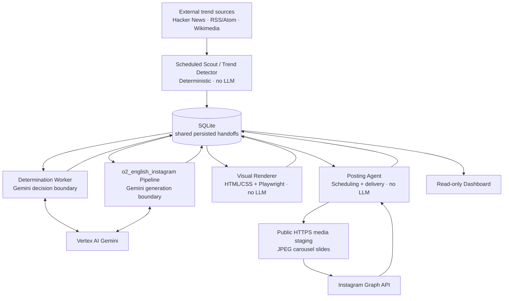
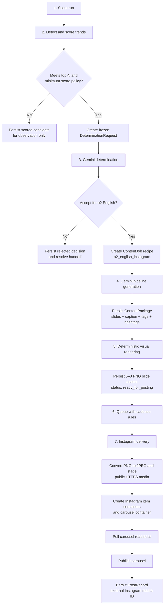
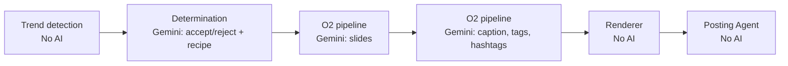
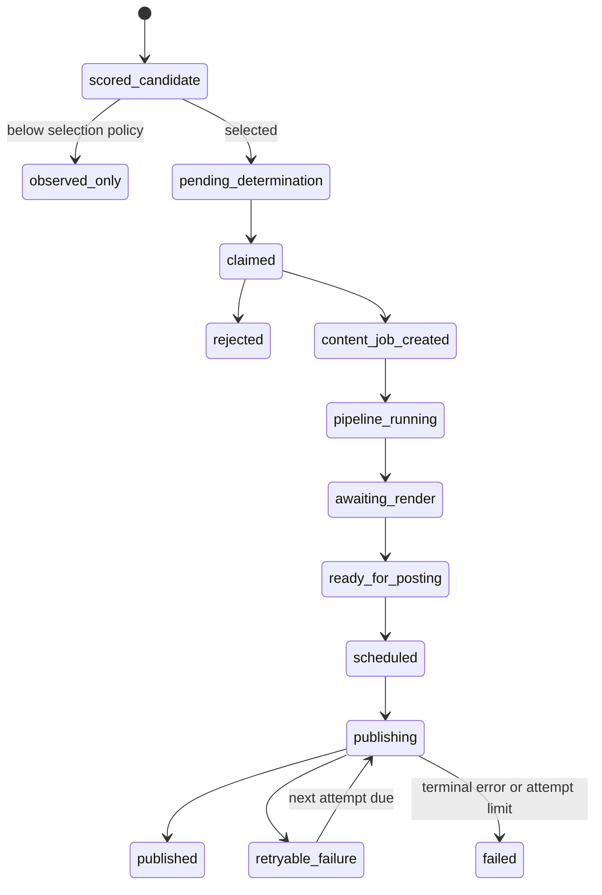

# System Flow Reference

This is the working reference for how data moves through the Content Factory.
It describes the active local-first POC path, not a future generalized system.

## System At A Glance



Every solid handoff between system components goes through SQLite. Components
do not call the next component directly. The dashboard only reads persisted
state; it never creates work or changes workflow state.

## End-To-End O2 English Instagram Path



## Persisted Handoffs And Ownership

| Phase | Writer | Persisted output | Next reader | AI call? |
| --- | --- | --- | --- | --- |
| Trend collection and scoring | Trend Detector | `trend_observations`, `topic_snapshots`, `trend_candidates`, `detection_runs` | Determination selection | No |
| Downstream selection | Trend Detector | `determination_handoffs` with frozen `DeterminationRequest` | Determination Worker | No |
| Consume/reject decision | Determination Worker | `determination_decisions`; accepted decision creates `content_jobs` | Pipeline Runner | Yes — Gemini decides whether and how to consume the candidate |
| O2 content creation | `o2_english_instagram` pipeline | `content_packages` containing validated slides, caption, tags, hashtags, visual specification | Visual Renderer | Yes — Gemini generates slides, then separately generates metadata |
| Render assets | Visual Renderer | Updates package `assets` and status | Posting Agent | No |
| Schedule delivery | Posting Agent | `posts` row with schedule and idempotency boundary | Posting Agent | No |
| Publish to Instagram | Posting Agent + Instagram adapter | `post_attempts`, `instagram_containers`, completed `posts` record | Dashboard / audit | No |

`api_usage` is an append-only record for successful Gemini calls. It records
the owner, phase, model, token counts, and optional estimated cost. It is not a
workflow queue.

## AI Boundaries



Gemini is never used to collect trends, calculate trend scores, choose a
low-level renderer template, render assets, schedule a post, or change content
after a `ContentPackage` is persisted.

## Lifecycle States



Candidate lifecycle is separate from determination-handoff lifecycle. A trend
can remain visible and keep accumulating evidence while an individual handoff
is already resolved or inside cooldown.

## O2 Instagram Delivery Detail

The Posting Agent accepts only a ready package whose destination matches its
persisted platform/account. For the active target that is:

```text
pipeline_id: o2_english_instagram
platform: instagram
account: o2_english
content_format: instagram_idiom_carousel
```

The delivery adapter does the following without changing creative content:

1. Verifies the package contains 2–10 rendered assets; the o2 format itself
   requires 5–8 slides.
2. Converts local PNG slides to JPEG for Instagram delivery.
3. Uploads each JPEG through the configured public-asset-store adapter.
4. Creates one Instagram container per slide, then one parent carousel
   container containing those children.
5. Records container IDs in SQLite and polls the parent status.
6. Publishes only when Meta reports the parent container ready.
7. Records the external Instagram media ID on the post record.
8. Persists transient failures with exponential backoff; configuration and
   package-contract failures are terminal.

The public HTTPS media store and Meta credentials are local configuration. They
must never be committed and are not available to the content pipeline or
renderer.

## Operational Readers

| Reader | What it may do | What it must not do |
| --- | --- | --- |
| Scout | Collect, normalize, score, and create eligible determination handoffs | Call Gemini or generate content |
| Determination Worker | Claim one handoff and write a decision / ContentJob | Invoke a pipeline directly |
| Pipeline Runner | Claim pending jobs and create ContentPackages | Render or publish |
| Visual Renderer | Render package visual specifications and mark complete assets | Alter caption, tags, hashtags, or scheduling |
| Posting Agent | Queue, retry, deliver, and record publication history | Generate or modify creative content |
| Dashboard | Read and report persisted state | Trigger, approve, schedule, or publish work |

## Current Preconditions For A Live End-To-End Run

- The local SQLite database is initialized and workers use the same database
  path.
- Vertex Gemini configuration and IAM access are available for determination
  and pipeline generation.
- Playwright browsers are installed for PNG rendering.
- An o2 English Instagram Professional account, Meta app credentials, and
  public media store credentials are configured locally for posting.
- The Mac Mini is awake and the scheduled workers are running.

For command-level operating instructions, see
[runbooks/local-runtime.md](runbooks/local-runtime.md). For exact field-level
contracts, see [interfaces.md](interfaces.md).
