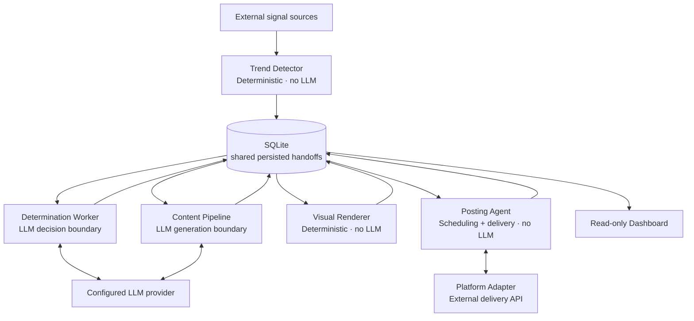
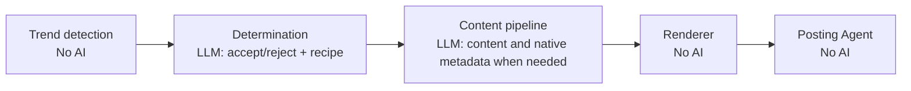
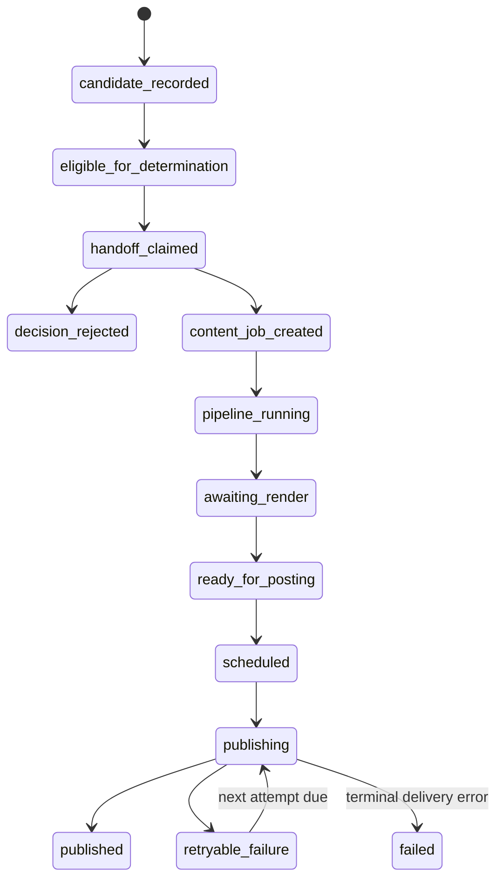

# System Flow Reference

This reference describes how system components exchange persisted work and how
responsibilities remain separated.

## System At A Glance

Every component-to-component handoff goes through SQLite. A writer persists an
explicit status and output; the next reader discovers eligible work. The
dashboard is an observer only.

## Persisted Handoffs And Ownership

| Phase | Writer | Persisted output | Next reader | AI call? |
| --- | --- | --- | --- | --- |
| Collection and scoring | Trend Detector | observations, snapshots, candidates, detection runs | Determination selection | No |
| Downstream selection | Trend Detector | frozen `DeterminationRequest` | Determination Worker | No |
| Consume/reject decision | Determination Worker | decision; accepted decision creates `ContentJob` | Pipeline Runner | Yes — interpretation and recipe selection |
| Content creation | Selected pipeline | `ContentPackage` with native content, metadata, and visual specification | Visual Renderer | May be used for generation |
| Asset rendering | Visual Renderer | completed asset references and package status | Posting Agent | No |
| Schedule and delivery | Posting Agent | delivery request, attempts, artifacts, and publication record | Dashboard / audit | No |

`api_usage` is an append-only ledger for successful external LLM calls. It
records the owner, phase, model, token counts, and optional estimated cost; it
is never a workflow queue.

## AI Boundaries

LLMs are used only for interpretation and pipeline-owned generation. They do
not collect or score trends, perform deterministic rendering, schedule
delivery, or modify a package after it is persisted.

## Lifecycle States

Candidate lifecycle is separate from handoff and delivery lifecycle. The same
candidate can continue to gather evidence while a particular handoff or post
record reaches its own terminal state.

## Operational Readers

| Reader | What it may do | What it must not do |
| --- | --- | --- |
| Trend Detector | Collect, normalize, score, and create eligible determination handoffs | Call an LLM or generate content |
| Determination Worker | Claim a handoff and write a decision / ContentJob | Invoke a pipeline directly |
| Pipeline Runner | Claim pending jobs and create ContentPackages | Render or publish |
| Visual Renderer | Render package specifications and record complete assets | Alter native metadata or scheduling |
| Posting Agent | Queue, retry, deliver, and record publication history | Generate or modify creative content |
| Dashboard | Read and report persisted state | Trigger, approve, schedule, or publish work |

For the active POC limits, see [poc.md](poc.md). For a concrete pipeline's
format and delivery behavior, see its pipeline documentation.
