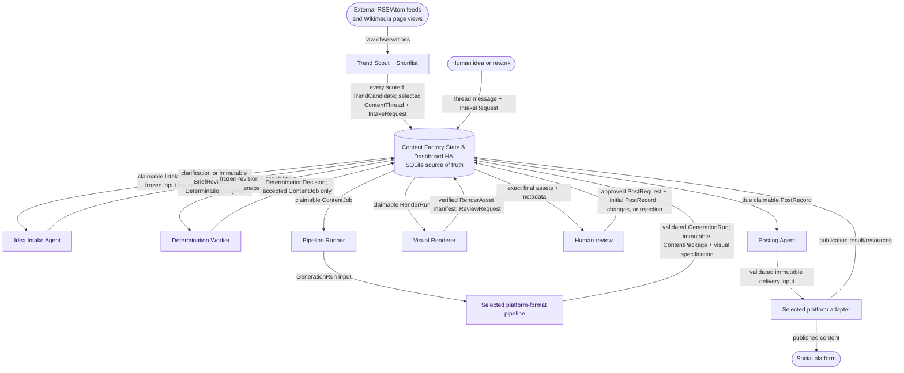

# Content Factory System Guide

This is the primary Human–Agent Interface (HAI) and the current source of
truth for Content Factory. It is deliberately a map, not an encyclopedia:
read it first, then open only the focused specification needed for the task.

## Documentation Contract

The documentation is a two-tier, repository-local system of record for people
and Codex:

- **Tier 1 — this guide:** the stable architectural map. It defines shared
  boundaries, names the canonical owner of each concern, and routes a task to
  the detailed contract. It contains no field-level schema or implementation
  recipe.
- **Tier 2 — focused contracts and references:** the documents routed below.
  Each owns one concern and is the only place its detailed rules are changed.
  `specs/` documents define the required target behavior; `pipelines/` defines
  a pipeline contract; `platforms/` records provider facts; `archive/` is
  historical rationale only.

The documentation is not a live implementation-status tracker. It defines the
intended architecture. Current behavior is verified from code, tests, and
explicit migration notes. Provider facts are time-sensitive and carry a
verification date. A summary in one document must link to its canonical Tier 2
owner rather than restate detailed rules.

## Document Router

| Work | Required follow-up reference |
| --- | --- |
| Schema, migrations, statuses, handoffs, or SQLite models | [Data model](specs/data-model.md) |
| Dashboard, human actions, freshness display, or visibility | [Dashboard and HAI](specs/dashboard.md) |
| Worker scheduling, polling, launch/restart, cadence, or runtime ownership | [Worker runtime](specs/runtime.md) |
| Detection sources, normalization, scoring, selection, recurrence, or evidence quality | [Detection specification](specs/detection.md) |
| Human idea intake, brief revisions, capability selection, or determination outcomes | [Idea Intake and Determination](specs/idea-intake-and-determination.md) |
| Shared renderer tools, visual profiles/templates, fonts, local assets, or render quality | [Visual rendering](specs/visual-rendering.md) |
| Post now, schedule, cancellation, delivery attempt, platform adapter, R2 staging, or reconciliation | [Posting Agent](specs/posting.md) |
| Worker recovery, idempotency, artifact integrity, Gemini accounting, or external-side-effect safety | [Reliability and safety](specs/reliability.md) |
| O2 content/metadata/format or Instagram delivery contract | [O2 English Instagram pipeline](pipelines/o2-english-instagram.md) |
| Meta accounts, permissions, tokens, or Graph API facts | [Meta platform reference](platforms/meta.md) |

The historical [decision archive](archive/decisions.md) is preserved for a
specific rationale lookup. It is not required working context.

### Required reading for a code change

Always read this Tier 1 guide first. Then read every Tier 2 document named for
the change below before modifying code. The list is intentionally cumulative:
for example, changing a post lifecycle may require data, runtime, reliability,
dashboard, pipeline, and platform contracts.

| Planned change | Required Tier 2 reading |
| --- | --- |
| Detection source, aggregation, score, shortlist, or trend recurrence | `specs/detection.md`, `specs/data-model.md`, `specs/runtime.md`; add `specs/dashboard.md` when visibility changes |
| Persisted model, status, identity, migration, or SQLite boundary | `specs/data-model.md` plus every owning specification affected by that record |
| Human idea, revision, brief, capability catalog, determination, or routing outcome | `specs/idea-intake-and-determination.md`, `specs/data-model.md`, `specs/dashboard.md`, `specs/reliability.md`; add `specs/runtime.md` when worker behavior changes and the selected pipeline reference when capability eligibility changes |
| Dashboard reporting view only | `specs/dashboard.md`, `specs/data-model.md` |
| Review decision, Post now, schedule, delivery cancellation, or reconciliation command | `specs/dashboard.md`, `specs/data-model.md`, `specs/posting.md`, `specs/runtime.md`, `specs/reliability.md`; add the selected pipeline/platform references for destination-specific behavior |
| Worker process, schedule, lease, retry, startup, shutdown, or health | `specs/runtime.md`, `specs/data-model.md`, `specs/reliability.md`; add `specs/dashboard.md` when cadence or freshness presentation changes |
| Shared renderer tool/provider, profile/template, font, local visual asset, or render validation | `specs/visual-rendering.md`, `specs/data-model.md`, `specs/reliability.md`; add `specs/runtime.md` when worker behavior changes |
| O2 content, metadata, visual format, capability eligibility, or package validation | `pipelines/o2-english-instagram.md`, `specs/visual-rendering.md`, `specs/data-model.md`, `specs/reliability.md`; add `specs/idea-intake-and-determination.md` when capability eligibility/routing changes |
| Posting Agent, delivery lifecycle, R2 staging, publication, or reconciliation | `specs/posting.md`, `specs/data-model.md`, `specs/runtime.md`, `specs/reliability.md`, `specs/dashboard.md`; add pipeline/platform references for the selected destination |
| Instagram/Meta account, credentials, or Graph API behavior | `platforms/meta.md`, `pipelines/o2-english-instagram.md`, `specs/posting.md`, `specs/data-model.md`, `specs/reliability.md` |
| Gemini invocation, token/cost ledger, prompt/schema version, or provider-attempt outcome | `specs/data-model.md`, `specs/reliability.md`, and the owning Gemini-stage contract: `specs/idea-intake-and-determination.md` or the selected pipeline reference |
| Migration or target-schema cutover | `specs/data-model.md`, `specs/runtime.md`, `specs/reliability.md`, `specs/dashboard.md`, plus every owning specification whose records are migrated |

When a change alters a contract, update the canonical Tier 2 document in the
same change as the code and boundary tests. Update this guide only if the
system boundary, routing, or document ownership changes.

## Current Objective

Prove that `o2_english_instagram` can run on the Mac Mini: it
discovers or accepts an idea, produces and renders an O2 English carousel,
makes it available for human review, and publishes to Instagram only after
human approval. Expansion follows only after this loop is reliable.

## Components, Inputs, and Persisted Outputs

Components do work. Records are persisted handoffs. They are not interchangeable
names. SQLite is the authoritative cross-worker boundary; the dashboard renders
that state and writes only its approved human command records.

### Target persisted flow

Every arrow label below is a persisted input or output. Components never call
the next component directly. The combined state/dashboard entity is SQLite as
the source of truth plus its read/write Human–Agent Interface.



Key record distinctions:

- The Scout persists **every** `TrendCandidate`; only a selected candidate
  atomically opens a trend `ContentThread` and pending `IntakeRequest`.
- Human idea/rework commands atomically append their message and create the
  pending Intake request. The Idea Intake Agent never relies on unread-message
  inference or an in-memory handoff.
- `BriefRevision` is the shared immutable input for trend-originated and
  human-originated editorial work. Determination produces one decision and a
  `ContentJob` only when accepted.
- `ContentJob` is an executable recipe; `GenerationRun` is a validated creative
  checkpoint; `ContentPackage` is immutable platform-specific creative and
  metadata.
- `RenderRun` produces the exact final assets reviewed by a human. Approval
  creates a `PostRequest`; the Posting Agent records delivery in a `PostRecord`
  and its attempts/resources.
- The dashboard persists only the human message/Intake handoff and the narrow
  delivery/review/reconciliation commands. It never invokes an agent or a
  platform API directly.

The Pipeline Runner is the production worker process. Registered pipelines are
in-process, platform/format-specific strategy implementations selected from the
claimed job; they are not separately scheduled worker services. The runner
persists a `GenerationRun`, invokes the selected strategy within its bounded
responsibility, and persists the strategy result. SQLite remains the boundary
before the runner and after generation, so this internal dispatch does not
create a direct cross-worker call.

## Opportunity Intake and Revisions

Trend detection stays deterministic and LLM-free. It measures attention; it
does not create content. The detailed source, scoring, selection, and
recurrence contract is in the [detection specification](specs/detection.md).

Human intake is a dashboard conversation, not a mandatory form. The Idea Intake
Agent may ask concise questions or make suggestions, but never silently drops a
submitted idea. Every submitted turn has a durable `IntakeRequest`. Once
sufficient context exists, Intake atomically freezes an immutable
`BriefRevision` and its pending Determination request.

`ContentThread` is the source-neutral history for an idea. A selected trend and
a human conversation each start a thread. Revision 1 is the first agreed brief;
a later instruction such as “make this more humorous” creates Revision 2 in the
same thread. Historical jobs, packages, reviews, and posts are never edited.
This revision model applies equally to trend-originated and human-originated
work. The detailed records, trend recurrence, and duplicate rules are in the
[data model](specs/data-model.md) and [detection specification](specs/detection.md).
The detailed intake, freeze, capability-selection, and decision contract is in
[Idea Intake and Determination](specs/idea-intake-and-determination.md).

## Determination, Production, and Posting Boundaries

Determination decides whether and how a normalized opportunity becomes a
production recipe. It evaluates registered capabilities; it does not generate
content or call pipelines. O2 English Instagram is initially the sole enabled
capability.
Its outcome contract is owned by
[Idea Intake and Determination](specs/idea-intake-and-determination.md).

`ContentJob` is a recipe. The O2 pipeline creates the actual `ContentPackage`:
creative, caption, tags, hashtags, citations, and visual specification. The
shared [Visual Rendering Layer](specs/visual-rendering.md) renders that frozen
specification through a versioned local renderer provider. The renderer owns
reusable visual profiles; each pipeline selects one or more compatible profiles
for its content/format, then persists that resolved selection. Posting uses the
persisted creative and verified assets unchanged.

Every ready package enters human review in the target. You can **Post now**,
schedule, reject, request a revision, or cancel an unclaimed scheduled delivery.
**Post now** is the dashboard action for an actual post: it durably creates
an immediate-mode `PostRequest` and initial `PostRecord`; the Posting Agent
claims the record when the active posting policy makes it due and delivers it. The
dashboard never calls Instagram directly. Instagram `media_publish` is public
and irreversible; no private/draft outcome exists for this carousel path.
The generic delivery lifecycle is owned by the [Posting Agent](specs/posting.md).
Publication safety, retries, R2 cleanup, and uncertain outcomes are owned by
[reliability](specs/reliability.md).

## Local Operation and Verification

The Mac Mini is the primary runtime:

```sh
/opt/homebrew/bin/python3.12 -m venv .venv
./.venv/bin/python -m pip install -e '.[dev]'
```

Copy [the root configuration template](../.env.example) to local `.env`; never
commit populated values. Gemini requires `GOOGLE_CLOUD_PROJECT`,
`GOOGLE_CLOUD_LOCATION`, and Application Default Credentials via
`gcloud auth application-default login`. O2 delivery variables are in the
[pipeline reference](pipelines/o2-english-instagram.md).

Before handoff, run:

```sh
./.venv/bin/python scripts/run_tests.py
./.venv/bin/python scripts/check_docs.py
```

Safe external checks are `scripts/test_r2_public_asset_store.py` (temporary
R2 write/read/delete) and `scripts/test_instagram_credentials.py` (read-only
Meta check). `scripts/smoke_test_o2_instagram.py --live` can publish a real
public carousel; use it only with explicit authorization and an isolated test
database/package.

## Documentation Ownership and Maintenance

| Document | Owns | Must not duplicate |
| --- | --- | --- |
| `system.md` | Current objective, responsibility boundaries, high-level architecture, document router | Field-level schema, dashboard columns/cadence, or safety implementation detail |
| `specs/data-model.md` | Tables, fields, statuses, constraints, migrations | Generic component ownership or vendor API facts |
| `specs/dashboard.md` | Visibility, HAI commands, navigation, freshness display, stale/alert policy | Database field definitions or worker implementation internals |
| `specs/runtime.md` | Worker process boundaries, scheduler/supervisor contract, polling cadence, claim/no-work/restart behavior | Dashboard layout, field-level schema, or social API contract |
| `specs/detection.md` | Detection sources, evidence, normalization, scoring, shortlist selection, recurrence | Worker recovery, dashboard layout, or table-level schema inventory |
| `specs/idea-intake-and-determination.md` | Free-text intake, brief freeze, capability catalog, AI decision outcomes, and decision acceptance tests | Detection algorithms, field-level schema, delivery safety, or creative generation |
| `specs/visual-rendering.md` | Shared local renderer providers, reusable profile/template registry, fonts/assets, deterministic rendering, and quality direction | Pipeline editorial layouts, field-level schema, worker scheduling, or delivery safety |
| `specs/posting.md` | Generic Posting Agent lifecycle, adapter invocation, delivery staging, resources, and reconciliation input | Provider API facts, pipeline format requirements, schema fields, or retry policy |
| `specs/reliability.md` | Cross-cutting recovery, idempotency, artifact integrity, configuration, and external-side-effect safety | Normal component/adapter lifecycle, UI layout, or table-level schema inventory |
| `pipelines/` | Pipeline-specific content/format/delivery contracts | Generic architecture or provider account model |
| `platforms/` | Provider accounts, permissions, API limits, sources | Pipeline creative contract |
| `archive/` | Historical rationale | Current policy |

- Update this guide when current objective, ownership, or top-level operating
  policy changes.
- Update the one owning focused specification for detailed changes, and link
  rather than repeat it elsewhere.
- Preserve the historical archive; do not use it as a routine change log.
- Keep secrets, tokens, and private media out of Git and documentation.
