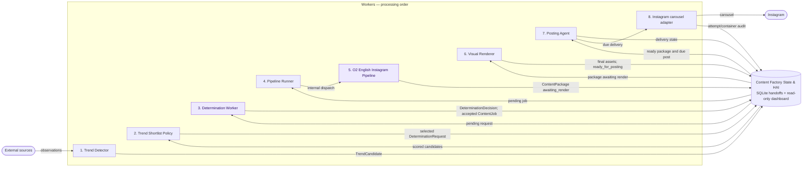
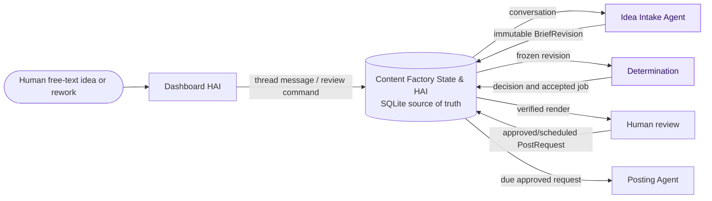

# Content Factory System Guide

This is the primary Human–Agent Interface (HAI) and the current source of
truth for Content Factory. It is deliberately a map, not an encyclopedia:
read it first, then open only the focused specification needed for the task.

## Document Router

| Work | Required follow-up reference |
| --- | --- |
| Schema, migrations, statuses, handoffs, or SQLite models | [Data model](specs/data-model.md) |
| Dashboard, human actions, worker cadence, freshness, or visibility | [Dashboard and HAI](specs/dashboard.md) |
| Detection quality, recovery, rendering, posting, R2, Gemini accounting, or 24/7 safety | [Reliability and safety](specs/reliability.md) |
| O2 content/metadata/format or Instagram delivery contract | [O2 English Instagram pipeline](pipelines/o2-english-instagram.md) |
| Meta accounts, permissions, tokens, or Graph API facts | [Meta platform reference](platforms/meta.md) |

The historical [decision archive](archive/decisions.md) is preserved for a
specific rationale lookup. It is not required working context.

## Current Objective

Prove that `o2_english_instagram` can run continuously on the Mac Mini: it
discovers or accepts an idea, produces and renders an O2 English carousel,
makes it available for human review, and publishes to Instagram only after
human approval. Expansion follows only after this loop is reliable.

“24/7” means continuous automated movement through safe stages. It does not
mean autonomous public posting.

## Current State

| Area | Current implementation | Approved target |
| --- | --- | --- |
| Trend detection | Deterministic and SQLite-persisted | One opportunity source with normalized evidence and duplicate controls |
| Human ideas/revisions | Not implemented | Free-text conversations and source-neutral immutable revisions |
| Determination | Trend-shaped handoffs; static O2 catalog | Normalized trend/human revisions; enabled capability catalog |
| O2 pipeline | Fixed 5–8 slide Instagram idiom carousel | Only production pipeline until reliability is proven |
| Visual rendering | Deterministic HTML/CSS + Playwright O2 renderer | Shared renderer catalog with verified asset manifests |
| Posting | SQLite queue, Instagram/R2 adapter, retry/audit records | Human review gate, conservative external-side-effect policy |
| Dashboard | Partial read-only reporting | Sole HAI with complete visibility and narrow persisted human commands |
| External readiness | R2 and Meta read-only checks passed | One explicit live O2 post remains to be proven |

No live Instagram post has yet been made by this system. Token renewal,
production media retention, worker supervision, human intake/review, complete
dashboard coverage, and target schema implementation remain work to do.

## Components, Inputs, and Persisted Outputs

Components do work. Records are persisted handoffs. They are not interchangeable
names. SQLite is the authoritative cross-worker boundary; the dashboard renders
that state and writes only its approved human command records.

### Current implemented flow



Current record distinctions:

- A `TrendCandidate` is durable scored evidence. The shortlist applies the
  score/top-N policy and creates a frozen `DeterminationRequest` only for
  selected work.
- A `DeterminationDecision` records why an opportunity was accepted or
  rejected. A `ContentJob` exists only for an accepted decision and contains
  the executable recipe.
- A `ContentPackage` is the actual platform-specific creative and metadata.
  Current rendering updates its assets; the target separates immutable package,
  render run, and review state in the data model.
- Current `posts` combines a delivery request and outcome. The target separates
  `PostRequest`, `PostRecord`, attempts, resources, and cleanup.

### Approved target extension



The dashboard never calls the next component directly. Workers consume the
records written by the preceding component.

## Opportunity Intake and Revisions

Trend detection stays deterministic and LLM-free. It measures attention; it
does not create content. Automatic trend recurrence is conservative: accepted
candidates are consumed, while rejected candidates need both a three-day
cooldown and materially changed evidence before reconsideration.

Human intake is a dashboard conversation, not a mandatory form. The Idea Intake
Agent may ask concise questions or make suggestions, but never silently drops a
submitted idea. Once sufficient context exists, it freezes an immutable
`BriefRevision` for Determination.

`ContentThread` is the source-neutral history for an idea. A selected trend and
a human conversation each start a thread. Revision 1 is the first agreed brief;
a later instruction such as “make this more humorous” creates Revision 2 in the
same thread. Historical jobs, packages, reviews, and posts are never edited.
This revision model applies equally to trend-originated and human-originated
work. The detailed records and duplicate rules are in the
[data model](specs/data-model.md) and [reliability specification](specs/reliability.md).

## Determination, Production, and Posting Boundaries

Determination decides whether and how a normalized opportunity becomes a
production recipe. It evaluates registered capabilities; it does not generate
content or call pipelines. O2 English Instagram is the only active capability.

`ContentJob` is a recipe. The O2 pipeline creates the actual `ContentPackage`:
creative, caption, tags, hashtags, citations, and visual specification. The
renderer produces assets; Posting uses persisted creative and assets unchanged.

Every ready package enters human review in the target. You can approve now,
schedule, reject, request a revision, or cancel an unclaimed scheduled delivery.
Instagram `media_publish` is public and irreversible; no private/draft outcome
exists for this carousel path. Publication safety, retries, R2 cleanup, and
uncertain outcomes are owned by [reliability](specs/reliability.md).

## 24/7 Operating Model

```text
continuous automated work:
  Scout → Shortlist → Intake/Determination → Pipeline → Renderer → review queue

human gate:
  approve now / schedule / reject / revise / cancel before publication

continuous delivery work:
  Posting → attempt audit → publication or reconciliation → R2 cleanup
```

Each worker operates through SQLite polling and persisted leases. The approved
cadence, health calculation, and stale thresholds are maintained in the
[dashboard specification](specs/dashboard.md); recovery and external-side
effect rules are maintained in [reliability](specs/reliability.md).

## Local Operation and Verification

The Mac Mini is the primary runtime:

```sh
/opt/homebrew/bin/python3.12 -m venv .venv
./.venv/bin/python -m pip install -e '.[dev]'
```

Copy [the root configuration template](../.env.example) to local `.env`; never
commit populated values. Gemini requires `GOOGLE_CLOUD_PROJECT`,
`GOOGLE_CLOUD_LOCATION`, and Application Default Credentials via
`gcloud auth application-default login`. O2 delivery variables are in the
[pipeline reference](pipelines/o2-english-instagram.md).

Before handoff, run:

```sh
./.venv/bin/python scripts/run_tests.py
./.venv/bin/python scripts/check_docs.py
```

Safe external checks are `scripts/test_r2_public_asset_store.py` (temporary
R2 write/read/delete) and `scripts/test_instagram_credentials.py` (read-only
Meta check). `scripts/smoke_test_o2_instagram.py --live` can publish a real
public carousel; use it only with explicit authorization and an isolated test
database/package.

## Documentation Ownership and Maintenance

| Document | Owns | Must not duplicate |
| --- | --- | --- |
| `system.md` | Current objective/status, responsibility boundaries, high-level architecture, document router | Field-level schema, dashboard columns/cadence, or safety implementation detail |
| `specs/data-model.md` | Tables, fields, statuses, constraints, migrations | Generic component ownership or vendor API facts |
| `specs/dashboard.md` | Visibility, HAI commands, navigation, cadence, stale/alert policy | Database field definitions or worker implementation internals |
| `specs/reliability.md` | Recovery, identities, quality, rendering/posting/configuration safety | UI layout or table-level schema inventory |
| `pipelines/` | Pipeline-specific content/format/delivery contracts | Generic architecture or provider account model |
| `platforms/` | Provider accounts, permissions, API limits, sources | Pipeline creative contract |
| `archive/` | Historical rationale | Current policy |

- Update this guide when current objective, ownership, or top-level operating
  policy changes.
- Update the one owning focused specification for detailed changes, and link
  rather than repeat it elsewhere.
- Preserve the historical archive; do not use it as a routine change log.
- Keep secrets, tokens, and private media out of Git and documentation.
